# Underpass height detection

> 1. Introduction
> 2. General pipeline \
> 2.1. Data preprocessing \
> 2.2. Perspective projection \
> 2.3. Facade texture extraction \
> 2.4. Height estimation methods \
> 2.5. Output data 
> 3. Assessment of results 
> 4. Conlcusions and recommendations

> Appendix A - Running the code \
> Appendix B - The U-Net model \
> Appendix C - Input files structure


## 1. Introduction
This repository focuses on developing a process to estimate <strong>underpasses heights using oblique images </strong>. The code is still in an experimental phase and is subject to improvements. In this report, we will provide a detailed explanation of the proposed process, highlighting points that require special attention, and give recommendations for further development.

Section 2 presents the proposed pipeline step by step, including the underlying principles and logic behind them. Section 3 presents the assessment of the methods based on a design experiment, comparing the three height estimation models, and outlying their advantages and drawbacks. Lastly, Section 4 gathers the main conclusions and provides recommendations for further research.

Appendix A provides instructions on how to run the code. Appendix B explains details of the U-Net model and includes recommendations for further improvement. Appendix C presents an overview of how the input files must be strcutured.

## 2. General pipeline


<p align="center">
  <strong>Figure 1.</strong> General pipeline
</p>

<p>
The general pipeline is depicted in <strong>Figure 1</strong>. The code takes as inputs the underpass polygons in GeoJSON format, a data set of oblique images with their corresponding camera parameters and image footprint polygons (<i>camera_parameters.txt, image_footprints.geojson</i>) and a set of 3D BAG tiles in GeoPackage format. 

The code iterates over each 3D BAG tile, and updates the estimated height of each observed underpass. Once it has iterated over all tiles, writes a GeoJSON file with final height estimations for each underpass. A more detailed description of each step is given in the upcoming sections.
</p>

### 2.1. Data preprocessing
<p>
The script <strong>data_preprocessing.py</strong> contains the functions for loading and processing input data. It fulfills the following tasks:

1. Loads the camera parameters, the image footprints, and the underpass polygons into <i>GeoDataFrames</i>.

2. In each iteration, loads the corresponding lod-22 in 2D (building footprints) and in 3D in two different <i>GeoDataFrames</i>.

3. Finds the underpass polygons which match the building footprints of the 3D BAG tile, and computes <strong>critical segments</strong>. The critical segments are the intersection between the underpass polygon boundary (buffered) and the building footprint boundary. This segments match the openings of the underpass. <strong>Figure 2</strong> shows four examples of computed critical segments and their corresponding facades in real life.

<table align="center">
<tr>
<td align="center">
<br>
</td>

<td align="center">
<br>
</td>
</tr>
</table>
<p align="center">
  <strong>Figure 2.</strong> Critical segments and their corresponding facades with underpass openings.
</p>

> [!NOTE]
> The critical edges step can be skipped if a dataset of the underpass edges is provided. This is recommended for higher efficiency and accuracy.

4. Computes the critical walls, which are 3D equivalents to the critical segments. This is done by intersecting the critical segments (buffered) with the 3D building geometries, which returns a set of 3D polygons (walls). Out of this set, we are interested in <strong>min_z</strong> and <strong>max_z</strong>. We will use these values combined with the critical segment coordinates to construct the critical wall geometry. The height of the critical wall is computed as <strong>max_z</strong> - <strong>min_z</strong> and stored as an attribute. <strong>Figure 3</strong> the corresponding critical walls of the critical segments shown in <strong>Figure 2</strong>.


<p align="center">
  
</p>
<p align="center">
  <strong>Figure 3.</strong> Computed critical walls in 3D view.
</p>

5. Constructs an <strong>image-wall</strong> visibility table. This is the most crucial step as it relates each image to a set of visible walls, which is later used in perspective projection. 
   <strong>Table 1</strong> shows an example of the output of such a table.

   <p align="center">
     <strong>Table 1:</strong> Image-wall visibility table.
   </p>


    <div align="center">

   | image_id              | visible_walls                         | camera_x       | camera_y       | camera_z   |
   |-----------------------|---------------------------------------|---------------:|---------------:|-----------:|
   | 402_0029_00131903.tif | [421, 422]                            | 142547.567520 | 488023.933861 | 445.913029 |
   | 402_0029_00131904.tif | [419, 420, 421, 422]                  | 142450.086788 | 488023.509496 | 444.967591 |
   | 402_0029_00131907.tif | []                                    | 142250.161996 | 488022.982741 | 444.541843 |
   | 402_0030_00131343.tif | [464, 298, 297]                       | 143708.653197 | 487789.798263 | 430.346762 |
   | 402_0030_00131344.tif | [465, 464, 461, 462, 298, 297, ...]   | 143807.812084 | 487789.429113 | 429.582020 |

    </div>

    The table is computed by first intersecting the image footprint polygons with the critical wall geometries. This creates a list of intersected wall_ids for each image. However, not all walls in this list are visible/valid. Therefore, we must filter according to the following criteria (<strong>Figure 4</strong>):
    <p> a) The normal of the wall is pointing towards the camera plane.</p>
    <p> b) The angle between the normal of the wall and the normal of the camera plane (θ) is less than a limit angle.</p>

  <table align="center">
    <tr>
    <td align="center">
    <br>
    </td>
    <td align="center">
    <br>
    </td>
    </tr>
    </table>

   <p align="center">
     <strong>Figure 4.</strong> Filtering criteria to determine wall visibility
   </p>

  > [!NOTE]
  > In future implementations, investigate facade occlusion as filtering criteria

</p>

### 2.2. Perspective projection
The module <strong>perspective_projection.py</strong> contains all functions to project critical wall geometries (encoded in EPSG:7415) onto the image plane. The code iterates through every row in the <strong>image-wall</strong> visibility table, performs the following tasks:

1. Extracts all visible walls per image

2. Computes the camera matrix $K$ for the current image. We can easily define it using the parameters in <strong>camera_parameters.txt</strong> as follows.
```math
K = 
\begin{bmatrix}
f_x & 0 & c_x \\
0 & f_y & c_y \\
0 & 0 & 1
\end{bmatrix}
```

3. Calculates the rotation matrix $R = R_\kappa \times \times R_\phi \times R_\omega $. We can find the angles $\kappa$, $\phi$ and $\omega$ in <strong>camera_parameters.txt</strong>, and then compute:
  
```math
R_\omega =
\begin{bmatrix}
1 & 0 & 0 \\
0 & \cos\omega & -\sin\omega \\
0 & \sin\omega & \cos\omega
\end{bmatrix}
```

```math
R_\phi =
\begin{bmatrix}
\cos\phi & 0 & \sin\phi \\
0 & 1 & 0 \\
-\sin\phi & 0 & \cos\phi
\end{bmatrix}
```

```math
R_\kappa =
\begin{bmatrix}
\cos\kappa & -\sin\kappa & 0 \\
\sin\kappa & \cos\kappa & 0 \\
0 & 0 & 1
\end{bmatrix}
```

  > [!CAUTION]
  > The multiplication order of rotation matrices depends on the convention chosen for the rotation angles. The given order <code>R = Rκ Rφ Rω</code> is standard for photogrammetry datasets, however, this might be different in your dataset (e.g. <code>R = Rω Rφ Rκ</code>).


  > [!CAUTION]
  > <code>R</code> might need to be transposed <code>R = R.T</code>. This applies when the rotation matrices are defined as rotations from the camera axes to the world axes. 

  > [!CAUTION]
  > <code>R</code> might need an axis flip. In some cases, the world coordinate system for certain axis has the opposite direction in the camera coordinate system.


4. Computes the translation vector $t$. This is straightforward when knowing the camera position coordinates $X, Y, Z$, which are defined in <strong>camera_parameters.txt</strong>

```math
t = - R \times \begin{bmatrix}
X \\
Y \\
Z
\end{bmatrix}
```


5. Computes the projection matrix $M$ for the current image.

```math
M = K \space [R \mid t]
```


6. For each visible wall, extracts the wall geometry and projects it onto the image plane using the projection matrix $M$.

```math
   \begin{bmatrix} u_h \\ v_h \\ w_h \end{bmatrix} 
   = M \, X_w 
```

   The 2D pixel coordinates are obtained by normalizing the homogeneous coordinates.

```math
   u = \frac{u_h}{w_h}, \quad v = \frac{v_h}{w_h}
```

<strong>Figure 5</strong> shows an example of critical walls projected onto the oblique image plane. These  2D polygons will be used in the facade texture extraction.

<p align="center">
  
</p>
<p align="center">
  <strong>Figure 5.</strong> Perspective projection of critical walls onto an oblique image
</p>

> [!CAUTION]
> The application of this method relies enormously on the quaity of the oblique image data set. Small errors or inconsistencies in the camera parameters will lead to wrong projections, which will ultimately affect the height estimation. Moreover, multi-cameras data sets might need particular adjustments for each camera (depending on their orientation). In summary, data accuracy is a must, and orientation consistency in all cameras is highly appreciated to increase the generalization of the method.


</p>

### 2.3. Facade texture extraction

The module <strong>facade_extraction.py</strong> includes the functions to extract, reproject and visualize the facade textures corresponding to the critical walls. This process is done by iterating over the 2D polygons resulting from the previous step. For each polygon:

1. Reorder the polygon coordinates to make sure that the reprojection is done consistently.

2. Compute the <strong>width</strong> and the <strong>height</strong> of the output reprojected facade.

3. The output image rectangle will be defined as:

  ```python
output_rectangle = np.array([
                [0, 0],
                [0, height-1],
                [width-1, height-1],
                [width-1, 0]
            ], dtype="float32")
  ```

4.  Apply the reprojection by establishing point correspondances between the 2D polygon and the output rectangle.

Assuming that the extracted facade image height corresponds to the height of the facade in the real world, we will be able to determine the height of the underpasss ceiling by establishing a relation pixel - meters. However, we must consider that vertical distances are distorted to a lesser or bigger extent, depending on the camera angle. The ideal situation is when the camera plane is parallel to the facade. <strong>Figure 6 </strong> shows an example of an extracted facade texture.

<p align="center">
  
</p>

<p align="center">
  <strong>Figure 6.</strong> Example of an extracted facade texture
</p>

> [!NOTE]
> Introducing a vertical correction factor to mitigate distortion could be a future research direction.

### 2.4. Height estimation methods
The module <Strong>height_estimation.py</Strong> contains all functions to estimate underpass heights from extracted facade images, visualizing, and writing the output data.

#### Connected components method
This naive method consists of applying image segmentation through detecting connected components in the facade image. The goal is to detect which component corresponds to the underpass opening by applying some filtering criteria.

1. Apply a Canny filter on the image and close edges to achieve more defined surfaces.

2. Detect connected component features in the image (delimited surfaces).

3. Apply filtering criteria to detect the underpass opening. The selected component must:

   a) be higher than a threshold (= 2 m);

   b) be close to the ground (< 100 px away from the bottom of the image); 
   
   c) be separated from the top (> 50 px away from the top of the image);

   d) have a parallelogram shape. This is measured by computing the solidity of the component, which is the area of its bounding box which is actually covered by the component. It is defined as:

   ```math
   solidity = \frac{component \space area}{component \space height \times component \space width}
   ```
   e) be centered in the image, since the image of the facade is constructed based on the underpass 2D geometry.

4. Takes the top pixel y-coordinate (<strong>pixel row</strong>) of the selected component, assuming that this corresponds to the underpass ceiling.

5. Estimates the underpass height with the following formula:

  $$ underpass \space height = facade \space height \times \frac{1 - pixel \space row \space}{image \space height} $$

  <table align="center">
    <tr>
    <td align="center">
    <br>
    </td>
    <td align="center">
    <br>
    </td>
    <td align="center">
    <br>
    </td>
    <td align="center">
    <br>
    </td>
    </tr>
    </table>
<p align="center">
  <strong>Figure 7.</strong> application of the connected components method. 
</p>


#### Depth map model method
This method uses a deep learning model that assigns depth values to each pixel in the image. Then, it assumes that the underpass corresponds to the deepest cluster of pixels. The model was applied from the commit `e5a2732d3ea2cddc081d7bfd708fc0bf09f812f1` (January 22nd, 2025).

1. Apply Depth-Anything-V2 model on the image.

2. Apply k-means clustering to group the regions by depth (by default 3 clusters)

3. Take the top pixel y-coordinate (<strong>pixel row</strong>) of the deepest cluster, assuming that this corresponds to the underpass ceiling.

4. Apply connected components segmentation to the deepest region and select the component that is closer to the ground. This helps getting rid of sky surfaces.

5. Take the top pixel y-coordinate (<strong>pixel row</strong>) of the selected component, assuming that this corresponds to the underpass ceiling.

6. Estimate the underpass height with the following formula:

  $$ underpass \space height = facade \space height \times \frac{1 - pixel \space row \space}{image \space height} $$

  <table align="center">
    <tr>
    <td align="center">
    <br>
    </td>
    <td align="center">
    <br>
    </td>
    <td align="center">
    <br>
    </td>
    <td align="center">
    <br>
    </td>
    </tr>
    </table>
<p align="center">

<p align="center">
  <strong>Figure 8.</strong> application of the depth map model method. 
</p>

#### U-Net model method
This method consists of applying a convolutional neural network that is trained to detect the underpass opening. The model was trained using images from facades extracted from oblique images. The limitations of the training data availability and hardware capabilities resulted in a still inaccurate model. However, it can be potentially improved in future research. Details on how to train the model are given in Apendix B.

1. Apply the U-Net model on the image, which returns a binary mask with the predicted underpass region.

2. Apply connected components segmentation to the underpass mask and select the component that is closer to the ground. This helps getting rid of outlier regions.

3. Take the top pixel y-coordinate (<strong>pixel row</strong>) of the selected component, assuming that this corresponds to the underpass ceiling.

4. Estimate the underpass height with the following formula:

  $$ underpass \space height = facade \space height \times \frac{1 - pixel \space row \space}{image \space height} $$

  <table align="center">
    <tr>
    <td align="center">
    <br>
    </td>
    <td align="center">
    <br>
    </td>
    <td align="center">
    <br>
    </td>
    </tr>
    </table>

<p align="center">
  <strong>Figure 9.</strong> application of the U-Net model method. 
</p>

### 2.5. Output data

Every time that an underpass height is estimated, this value is stored in a list of observations. Then, the final estimated height is recalculated as the average of all observed values.

Once all tiles have been iterated, the estimated heights will be definitive. The code then writes the underpass polygons with the estimated heights to a GeoJSON file.

The output files can be found under the `output/` folder (`underpass_heights_ccmethod.geojson`, `underpass_heights_depthmethod.geojson`, `underpass_heights_unetmethod.geojson`).


## 3. Assessment of results

In this section, we present the results of an experiment ran in an area of Rotterdam. Each method is assessed by comparing its output to ground truth data. At the end of this section, we discuss whether the ground truth data used is suitable for comparison, given some inconsistent results. The assessment results can be replicated by executing the script <Strong>assessment.py</Strong>. The output assessment files can be found under the `output/` folder (`assessment_ccmethod.geojson`, `assessment_depthmethod.geojson`, `assessment_unetmethod.geojson`)


###  Ground truth data
Our reference data is derived from the city model of 3D Rotterdam - https://www.3drotterdam.nl/. This dataset includes accurate modelling of building underpasses, including accurate height values. For comparison, we project the underpass ceiling polygon into 2D and include the measured height as one of its attributes. The ground truth underpasses can be found in `data/ground_truth/underpasses_rotterdam3d.geojson`.


### Design experiment:
The studied area corresponds to the following bounding box (EPSG:28992):

```text
minx = 90750, miny = 435300; maxx = 94680, maxy = 439700
```
The input oblique images were obtained from ProRail - https://spoorinbeeld.nl/ - which is responsible for monitoring the state of the railway network in the Netherlands. This dataset was selected due to its high quality, including accurate camera parameters which will facilitate the process. However, the dataset contains only oblique images captured along the railways, therefore, the study area is limited to regions surrounding the train tracks. 

The 3D building tiles were selected using the bounding box defined above and obtained from the 3D BAG website (https://www.3dbag.nl/en/download). In total, eight tiles were downloaded in geopackage format.

The code was executed on Kaggle, a platform which provides access to powerful hardware resources. To accelerate image processing, an NVIDIA Tesla P100 GPU was used. 

### Results
The original set of input underpasses consisted of 97 features. However, 15 of these lacked an estimated height (NULL values) across all methods. This is because the underpass walls did not meet the visibility criteria during the perspective projection phase (see Section 2.1, point 5), or the oblique images containing those walls were not available. Therefore, these were excluded from the assessment, having an actual sample of 82 features. We will base all calculated percentages on this figure.

<div align="center">
   <p align="center">
     <strong>Table 2:</strong> Assessment of the height estimation methods.
   </p>

| Method        | Run Time (min)  | Null Features | MAE (m) | RMSE (m) |
|:---------------:|:------------------:|:---------------:|:---------:|:----------:|
| CC     |      27.25       |        14       |    2.93     |     3.66     |
| Depth   |      24.90       |         14      |     2.39    |     3.17     |
| U-Net   |      18.67       |        4      |    1.99     |      2.56    |

</div>

> [!NOTE]
> The <Strong>Null Features</Strong> field presented in Table 2 corresponds to instances where a height estimation method was unable to make a prediction, and excludes the 15 features mentioned above. Note that the reasons for these null values differ.

#### Run time

From <Strong>Table 2</Strong>, we can infer that <Strong>the fastest method was the U-Net method</Strong>, while the slowest was the CC method. However, one remark is necessary for a correct interpretation: the depth method produced many cases in which the application of the Depth-Anything model caused a runtime error. In these cases, we executed an exception and skipped to the next facade. As a result, the total number of processed facades in the CC method was higher than in the depth method, which contributed to a longer runtime. This evidences that <Strong>the depth method remains the most computationally expensive</Strong>.

#### Null features
The CC method returned a null value in 17.07 % of the estimations, the highest together with the depth method. This is mainly due to its weakness, basing its pefromance on the quality of the detected edges. Contributing factors to failure include the presence of objects (e. g. trees, urban furniture), poor image quality (specially in terms of  brightness and contrast) and incorrect extraction of facade textures. All these may lead to a deficient segmentation, causing components to merge together, blend with the background, or form very small fragmented regions. As a result, none of the components pass the filtering criteria, and the method returns a null value. <Strong>Figure 10</Strong> shows a collection of facade images where the CC method failed to make a prediction.

  <table align="center">
    <tr>
    <td align="center">
    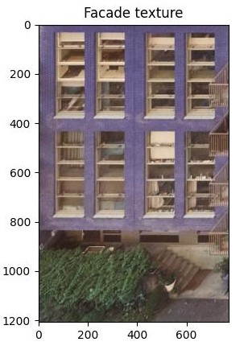<br>
    </td>
    <td align="center">
    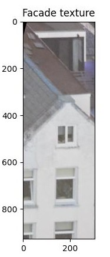<br>
    </td>
    <td align="center">
    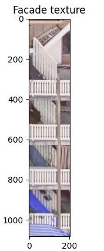<br>
    </td>
    <td align="center">
    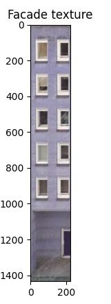<br>
    </td>
    </tr>
    </table>

<p align="center">
  <strong>Figure 10.</strong> From left to right: <Strong>(1)</Strong> presence of balconies in front of the facade (right side); <Strong>(2, 3) </Strong> wrong facade texture (no underpass present); <Strong>(4)</Strong> poor image quality avoids detecting the vertical edge on the left of the underpass, thus merging the underpass component with the background. 
</p>

The depth map method returned a null value in 17.07 % of the estimations. This is mainly due to runtime errors caused by complex images where depth information is unclear, or when city objects are present, which increases the computational cost of depth estimation. The method is also sensitive to incorrect extraction of facade textures. <Strong>Figure 11</Strong> shows a collection of facade images where the depth method failed to make a prediction.

  <table align="center">
    <tr>
    <td align="center">
    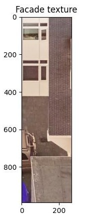<br>
    </td>
    <td align="center">
    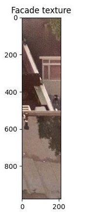<br>
    </td>
    <td align="center">
    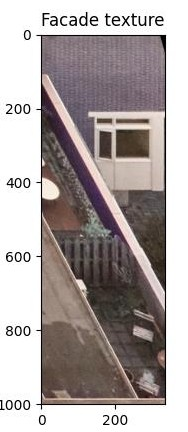<br>
    </td>
    </tr>
    </table>

<p align="center">
  <strong>Figure 11.</strong> From left to right: <Strong>(1)</Strong> unclear depth information; <Strong>(2) </Strong> incorrect facade texture (no underpass present); <Strong>(3)</Strong> presence of objects in front of the underpass (only visible on the right side, under the white window) 
</p>

The U-Net method returned a null value in 4.88% of the estimations. Compared to the other methods, it is more robust in producing non-null results. However, it may return a null value when facades are heavily occluded. This behavior is also due to the model being trained to detect cases where no underpass is present. <Strong>Figure 12</Strong> shows a facade image where the U-Net method failed to make a prediction.

<p align="center">
  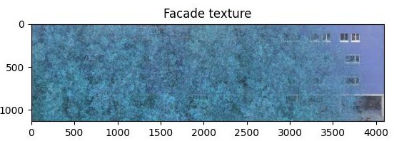
</p>

<p align="center">
  <strong>Figure 12.</strong> facade heavily occluded by a tree.
</p>

#### Mean Absolute Error (MAE) and Root Mean Squared Error (RMSE)

All three methods present a high MAE, with the CC method showing the largest error (±2.60 m) and the U-Net method the smallest (±1.80 m). Moreover, the RMSE is significantly higher than the MAE for all methods, which reflects the presence of large deviations in some predictions. Nevertheless, there are significant differences across the methods that are worth discussing.

The CC method again shows the poorest performance, since it only relies on connected components image segmentation and geometric analysis. Lacking semantic understanding prevents it from reliably determining whether an underpass is actually present in the facade. As a result, the method may mistakenly identify other elements as the underpass, estimating incorrect height that can deviate by several meters. Moreover, the filtering criteria remain simplistic, only returning accurate results under very specific conditions: when the image quality is high, the facade is fully visible and unoccluded, the facade aligns perfectly within the image bounds, and the underpass remains in the center of the image.

The depth map method is the second-worst performing strategy (±2.38 m). Like the CC method, this approach lacks semantic segmentation, making it susceptible to identifying other elements as the underpass. Errors increase dramatically when incorrect facade textures are extracted. Additionally, it is sensitive to image complexity, since k-means clustering may detect a deeper cluster than the actual underpass (e.g., the sky or rooms visible through windows). However, incorporating depth information in addition to plain geometry does improve the accuracy of predictions to some extent, as compared to the CC method.

The U-Net method shows the best performance (±1.80 m), yet highly inaccurate. Since it is based in a semantic segmentation model, it is less sensitive to occlusion. The model was also trained to detect cases where no underpass is present, enabling a better performance when incorrect facade textures are extracted. However, the model was trained defficiently (see Appendix B) and is subject to improvements. Therefore it may still produce height estimates that deviate several meters from the true values. Such errors occur less frequently compared to the other approaches.

#### Absolute error distribution
While mean error metrics (i.e. MAE and RMSE) provide a general indication of method performance, analyzing the distribution of absolute errors reveals interesting patterns such as the frequency and magnitude of deviations. In <Strong>Figure 13</Strong>, it can be observed that the CC approach presents a relatively flat distribution, suggesting that errors are spread more uniformly across a wide range of values. This indicates inconsistent performance, with no strong concentration around low error values. This method also produces the largest observed error - exceeding ±10.4 m - highlighting its sensitivity to image conditions.

A similar pattern is observed for the depth-based approach, although its distribution shows a slightly higher concentration of lower errors. This indicates a slight improvement in accuracy.

In contrast, the U-Net approach shows a more favorable error distribution. Its peak is below ±1 m, with the highest frequency of errors concentrated in the two first intervals (±0.2 m, ±0.4 m) and (±0.4 m, ±0.6 m). This indicates that, the U-Net approach produces more consistent predictions with fewer extreme deviations compared to the other approaches. However, accuracy is still a big concern.


<p align="center">
  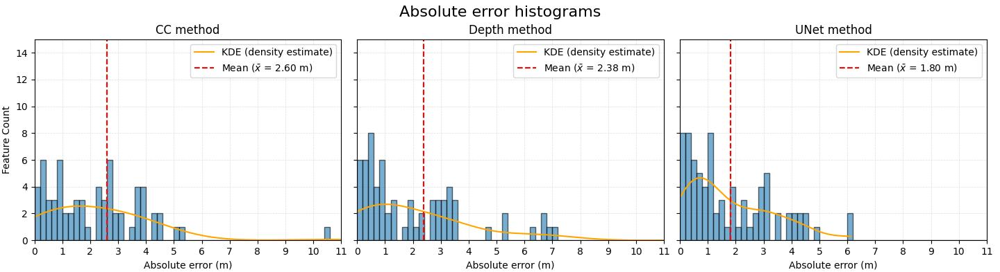
</p>

<p align="center">
  <strong>Figure 13.</strong> Absolute error distribution of the height estimation methods (bin size = 0.2 m)
</p>

<Strong>Table 3</Strong> presents an evaluation of performance under different error tolerances. Overall, none of the approaches achieves high accuracy under strict tolerance thresholds, altough we observe a slightly better performance of the CC method. However, this trend is not consistent and we can observe that the U-Net approach outperforms the other methods across all of the following tolerance levels, but its performance remains limited. For instance, under a strict tolerance of ±0.10 m, it correctly estimates only 2.35 % of the features. This increases to 9.41 % under a ±0.20 m tolerance, 18.82 % under ±0.40 m, and 31.76 % under ±0.80 m. On the contrary, the CC and depth map approaches perform worse overall. This reinforces the conclusion that the U-Net approach presents the highest robustness for height estimation.

<div align="center">
   <p align="center">
     <strong>Table 3:</strong> Performance of the height estimation methods for different tolerance thresholds.
   </p>

| Method |  High (±0.10)    | Acceptable (±0.20) | Defficient (±0.40)  | Very Deficient (±0.80) |
|:------:|:----------------:|:------------------:|:-------------------:|:----------------------:|
| CC     | 3.65 %           |4.88 %              | 12.20 %              | 18.82 %   |                      
| Depth  | 2.35 %           |7.06 %               | 14.12 %              | 28.23 %  |                      
| U-Net  | 2.35 %           |9.41 %              | 18.82 %              | 31.76 %  |                      

</div>

### Discussion of the assessment method
After plotting images with estimated and ground truth heights, some inconsistences in the ground truth data became apparent. In many cases, the ground truth height is higher than the actual underpass visible in the images. Moreover, some underpasses in the input data do not have onr-to-one correspondances in the ground truth dataset. <Strong>Figure 14</Strong> shows a collection of examples of such cases, making evaluation impossible. The full collection of images can be found in `output/visualizations_GT_unet`. The choice to generate images just for the U-Net method is due to its higher performance over the others.

  <table align="center">
    <tr>
    <td align="center">
    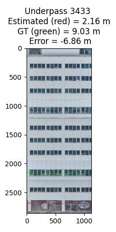<br>
    </td>
    <td align="center">
    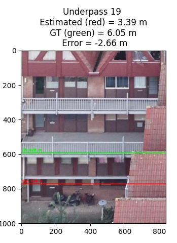<br>
    </td>
    <td align="center">
    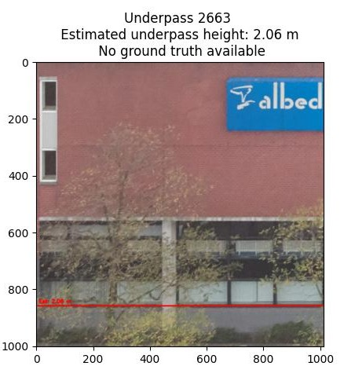<br>
    </td>
    </tr>
    </table>
<p align="center">

<p align="center">
  <strong>Figure 14.</strong> From left to right: <Strong>(1, 2)</Strong> over-dimensioning of ground-truth data; <Strong>(3) </Strong> no ground-truth correspondance found.
</p>

These findings lead to a closer inspection of the 3D Rotterdam dataset and a visual comparison with Google Earth 3D and Street View images, revealing that not all modelled underpasses reflect ground truth. In some cases, underpass heights are overestimated by several meters. In some other cases, they appear to have been assigned the height of the neighboring underpass.  

To test whether these inconsistencies influenced our assessment, we conducted a visual inspection of our ground truth sample. The height values were visually compared against Street View imagery and Google Earth 3D. When large discrepancies were identified, the height values were adjusted to more realistic values. To detect large discrepancies, we used other elements present in the image which height is usually standardized or easier to estimate (e.g. doors, people...). For example, one underpass appeared to be approximately one storey high but it was recorded as 9 m in the original ground truth data. This case was updated to 3 m. The updated ground truth dataset is available at `data/ground_truth/underpasses_rotterdam3d_revised.geojson`.

This quick experiment returned interesting insights when re-evaluating the methods. <Strong>Figure 15</Strong> shows the new absolute error histograms compared against the previous assessment. We can observe a clear shift, increasing counts in lower error beams, specially in the depth method and in the U-Net case. Moreover the MAE has decreased for all methods.

<p align="center">
  
</p>

<p align="center">
  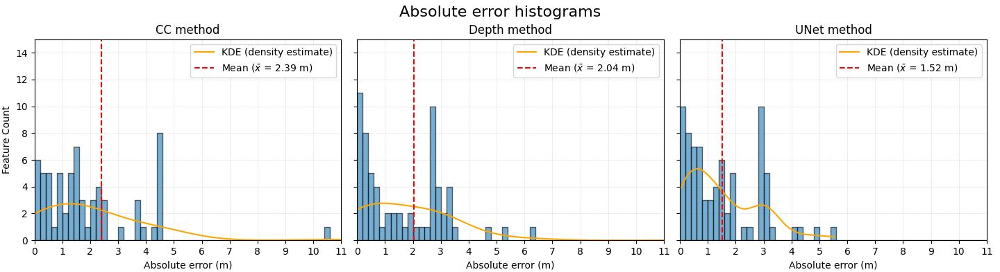
</p>

<p align="center">
  <strong>Figure 15.</strong> From top to bottom <Strong>(1)</Strong> absolute error distributions of first assessment; <Strong>(2)</Strong> absolute error distribution after revising the ground truth data (bin size = 0.2 m)


In the same trends, <Strong>Table 4</Strong> shows an increase on the performance of all height estimation methods under different tolerance thresholds.

<div align="center">
   <p align="center">
     <strong>Table 4:</strong> Performance of the height estimation methods for different tolerance thresholds before and after ground truth data revision.
   </p>

| Method |  High (±0.10)    | Acceptable (±0.20) | Defficient (±0.40)  | Very Deficient (±0.80) |
|:------:|:----------------:|:------------------:|:-------------------:|:----------------------:|
| CC - before       | 3.65 %           |4.88 %              | 12.20 %         | 18.82 %   |                      
| **CC - after**    | **4.88 %**     |**7.32 %**          | **13.41 %**     | **20.73 %**   |                       
| Depth - before    | 2.35 %           |7.06 %          | 14.12 %         | 28.23 %  | 
| **Depth - after** | **2.35 %**      |**13.41 %**         | **23.17 %**     | **34.15 %**  |                       
| U-Net - before    | 2.35 %           |9.41 %              | 18.82 %              | 31.76 %  |                      
| **U-Net -after**  | **4.88 %**       |**12.20 %**         | **21.95 %**          | **39.02 %**  |                      

</div>


Aside from the dubious ground truth data accuracy, another reason for increasing errors could be the input underpass polygons. These are not always properly split, and sometimes they are merged with underground surfaces. Therefore, establishing one-to-one correspondances with ground truth data is not feasible in some cases. <Strong>Figure 16</Srtrong> illustrates an example of this case.

<p align="center">
  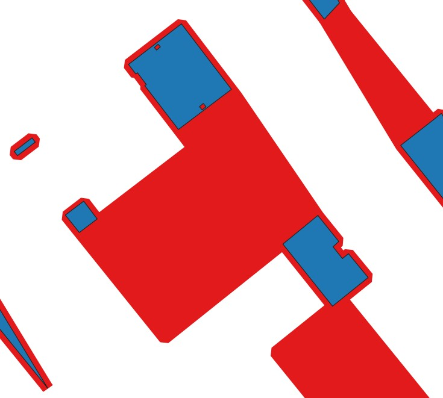
</p>

<p align="center">
  <strong>Figure 16.</strong> One input underpass polygon (in red) corresponds to multiple ground truth polygons (in blue). The red polygon is merged with undeground surfaces.
</p>

As a summary, the main points that should be considered to construct a good ground truth dataset are the following:

1. Ensure a one-to-one correspondence between the input 2D polygons and the ground truth polygons.
2. Ensure that underpass height values reflect real-world conditions.
3. As the focus of this study is on height estimation, it is preferable to include only underpasses with a single height value. For underpasses with multiple height values, one section may be selected, or the geometry may be split into separate parts. This prevents inconsistencies between different viewpoints (i. e., images captured from different walls).


## 4. Conclusions and recommendations
From the analysis in Section 3,  it can be concluded that none of the evaluated methods currently provides reliable underpass height estimations from oblique images. Moreover, the general process is subject to several improvements. In this section we outline recommendations to imrpove each stage of the method.

#### Data preprocessing 
Some estimation errors originate from the geometry of the underpasses themselves. For example, certain underpasses are merged with underground surfaces (e.g., parking areas), which can lead to multiple underpasses being represented as a single feature, returning only one height value. Moreover, critical walls corresponding to these underground areas may be incorrectly identified, resulting in extraction of incorrect facade textures. Therefore, it is recommended to input clean, independent underpass geometries.

Currently, two criteria are used to filter images in the visibility table: the angle between the facade and camera plane, and the direction of the facade normal. However, there are occassions where other buildings are occluding the projected facades on the image. Therefore, incorporating an occlusion filtering criteria could be helpful to avoid incorrect facade texture extraction. This could be done by projecting a line of sight from the camera center to the critical wall and checking for intersection with other walls (extracted from the 3D model).

#### Perspective projection
Accurate camera parameters are crucial for correct perspective projection. Furthermore, orientation consistency is a must when multiple cameras are used. Using high-quality datasets  is recommended to obtain reliable results.

#### Height estimation methods
The U-Net method currently shows the most promsising results, even though its accuracy remains low. This is partly due to the limited training set (approximately 250 images) and modest training parameters due to hardware constraints. A larger training dataset (around 1000 images) and more powerful hardware would enable the model to achieve much higher accuracies. Appendix B offers a description of this method as well as indications for better future training.

#### Output data
Currently, each observation is stored in a list, and the estimated height is computed as the average of all the observations. This apprach is sensitive to outliers, affecting the final estimation. Preliminary tests indicate that removing outliers via trimming before averaging heights returns more accurate predictions. Further exploration of statistical aggregation methods is recommended to improve robustness.


## APPENDIX A - Running the code

There is an example data set that can be used to run the code in the data folder. Some input files are already avilable in the repository and some others must be downloaded and added to the data folders. All the specifications are included in `data/test_data.txt`.

The following structure is necessary to run the code:

```text
3DBAG_UNDERPASS_HEIGHTS/
├── data/
│   ├── 3dbag_tiles/
│   ├── oblique_images/
│   └── underpass_polygons/
├── src/
│   ├── Depth-Anything-V2/
│   ├── u-net_model/
│   ├── data_preprocessing.py
│   ├── facade_extraction.py
│   ├── height_estimation.py
│   └── perspective_projection.py
├── output/
└── requirements.txt

```

STEP 1. Install requirements.txt in your virtual environment
```python
pip install -r requirements.txt
```
STEP 2. Select the height estimation method
```python
height_estimation_method = "depth_method" # or "cc_method", "unet_method"
```
STEP 3. Adjust input file names if necessary
```python
tiles_directory = "path_to_folder"
images_directory = "path_to_folder"
underpasses_directory = "path_to_folder"
depth_model_directory = "path_to_folder"
unet_model_directory = "path_to_folder"

camera_parameters_path = os.path.join(images_directory, 'camera_parameters.txt')
image_footprints_path = os.path.join(images_directory, 'image_footprints.geojson')
underpasses_path = os.path.join(underpasses_directory, 'underpasses.geojson')
underpass_edges_path = os.path.join(underpasses_directory, 'underpass_edges.geojson')
```
STEP 4. Run the code

```python
python src/main.py # From project root directory
```

## APPENDIX B - The U-Net model
A U-Net model is a Convolutional Neural Network (CNN) designed for image segmentation. In this project, it is used to detect the underpass region in facade images so that the underpass height can be estimated. The model outputs a binary mask for each input image, classifying pixels as either underpass (1) or non-underpass (0).

The main advantage of this model is its efficiency. Since only one class (underpass) needs to be detected, it requires less computational resources than the depth map method and can potentially provide more accurate results, as it is specifically designed for underpass detection.

However, the availability of training data may be a limitation. A model of decent quality typically requires around 1,000 training images. This requirement can be mitigated by reusing images and applying simple data augmentation techniques, such as flips, rotations, and contrast adjustments. Additionally, a powerful GPU may be necessary for training, depending on the chosen model parameters. Generally, higher GPU performance allows for more complex settings, which can lead to a more accurate model.

In this section, we describe the relevant files for the U-Net model used in this project, the training process, and the results obtained. Finally, some recommendations are provided for further improvement of the method.

### Relevant files and directories
All relevant files can be found in the directory `src/u-net_model/`. 

1. **`underpass_dataset.py`** — Defines the dataset class for loading and preprocessing training facade images and their ground-truth masks.

2. **`unet_parts.py`** — Contains the building blocks of the U-Net architecture.

3. **`unet.py`** — Defines the complete U-Net architecture by combining the parts from `unet_parts.py`.

4. **`model.py`** — Implements the training loop, loss functions, optimization, and validation logic. It trains the U-Net using the dataset and saves weights to `model.pth` when performance improves.

5. **`model.pth`** — The serialized trained model weights (PyTorch state dict). This file is loaded during inference to make predictions on new facade images without retraining.

6. **`inference.py`** — Loads the pre-trained `model.pth` and applies it to test facade images to generate binary segmentation masks that identify underpass regions.


### Training process 
The training data set used has a total of 261 images, of which 89 do not show any underpass (train negative behavior, empty prediction). Part of the images were extracted using the module `facade_extraction.py` implemented in this project. The rest was extracted manually by drawing polygons on oblique images around facades and reprojecting these automatically. The amount of training data is far from the typical values for such a model (around 1000). Moreover, the manually extracted images do not have very good quality, since the polygons drawn are imperfect, hence affecting the reprojection. Each image was manually labeled by drawing a polygon in the underpass region and saving a binary mask. <Strong>Figure B1</Strong> shows examples of the used training images and their corresponding masks.

<table align="center">
  <tr>
    <td align="center">
      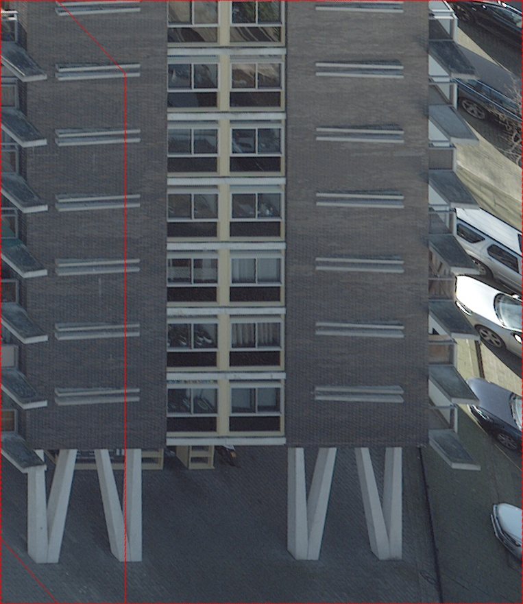<br>
    </td>
    <td align="center">
      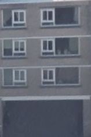<br>
    </td>
    <td align="center">
      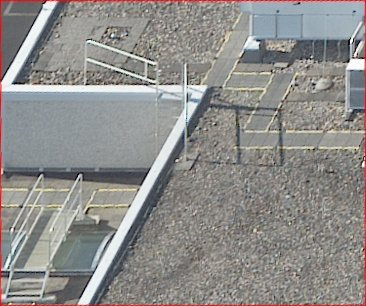<br>
    </td>
  </tr>
  <tr>
    <td align="center">
      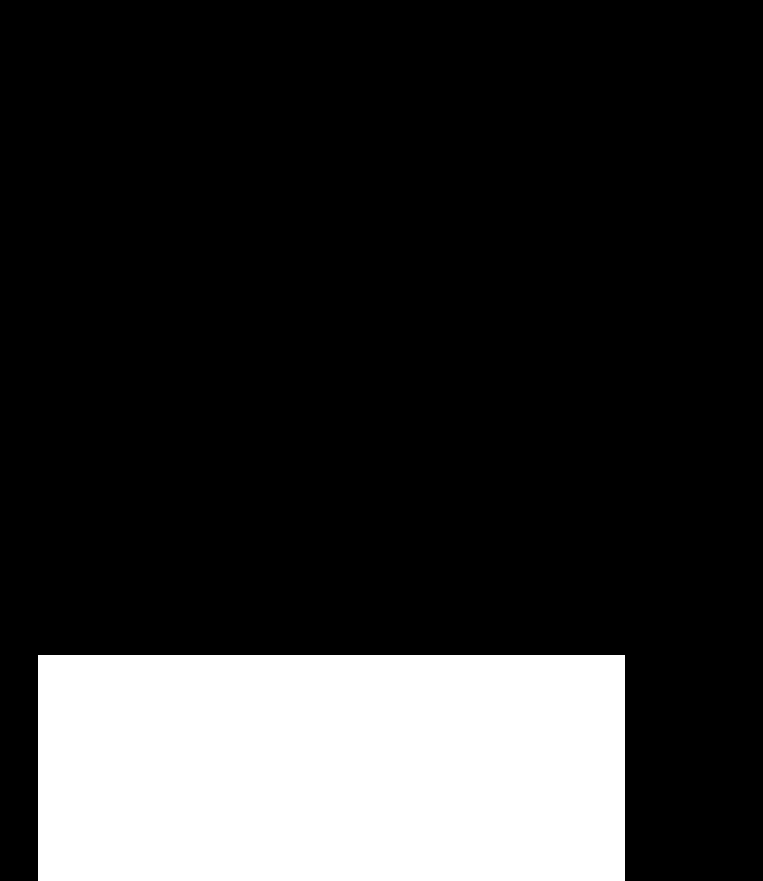<br>
    </td>
    <td align="center">
      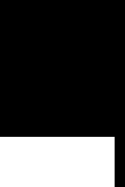<br>
    </td>
    <td align="center">
      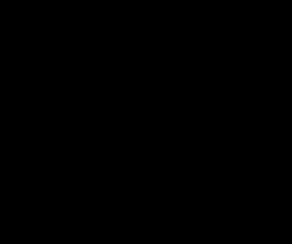<br>
    </td>
  </tr>
</table>

<p align="center">
  <strong>Figure B1.</strong> From left to right and top to botom: <Strong>(1)</Strong> automatically-extracted facade image; <Strong>(2) </Strong> manually-extracted facade image; <Strong>(3)</Strong> image with no underpass visible (train negative behavior); <Strong>(4, 5, 6)</Strong> corresponding image masks
</p>

Due to the limitations of the available hardware, the training parameters have been set to low standards:

a) Images are resized to 224 x 224 pixels for feeding into the network. Typically, higher image sizes (e. g. 512 x 512) return a more accurate model, at the cost of more processing memory.\
b) Learning rate is set to 5e-5.  \
c) Batch size is set to 16 (number of simultaneously processed images).\
d) The number of epochs is set to 120.

### Results of the current model

<Strong>Figure B2</Strong> shows the results of testing the U-Net model with a set of 9 facade images. The model generally performs well in cases where no underpass is present (negative case), correctly predicting empty masks in columns 2, 3, and 7. However, it incorrectly predicted an underpass in one case (column 5). For images containing an underpass (positive case) predictions in columns 1, 4, and 9 can be considered successful (since only the top pixel of the predicted mask is used to determine height). On the contrary, columns 6 and 8 contain incorrect predictions. Overall, the model produced correct masks in 6 out of 9 cases and incorrect masks in 3 out of 9 cases. This results can be potentially improved by implementing some changes in the training process.

<p align="center">
  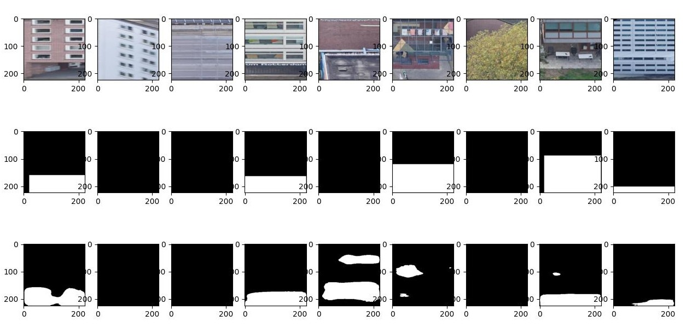
</p>

<p align="center">
  <strong>Figure B2.</strong> U-Net model applied to test data. The first row corresponds to the input images, the second row contains the ground truth masks (goal prediction), and the third row includes the predicitions made by the model.
</p>

### Recommendations for further improvement

1. Remove manually extracted images from the dataset to avoid distorted facades
2. Increase the number of training images to 1000. If possible, increase the size of the training set even more by modifying some of the images (i. e. apply flips, changes in contrast, changes in brightness...)
3. Keep 30% of the training images for negative training (no underpass present, and no mask)
4. Ensure consistent masking. Avoid creating a mask if the underpass is too occluded or barely visible.
5. Upgrade the image resize to 384x384. Improved resolution will result in better performance.
6. Increase epochs to 150-300, implementing early stop.


## APPENDIX C - Input files structure
The code only works if the input files stick to a specific schema. In this section, the different files schemas are presented.

> [!CAUTION]
> Currently, the code transforms and operates all spatial data in EPSG:7415. Therefore, modifications are needed if the method wants to be applied elsewhere than in the Netherlands.

### 3dbag_tiles
This directory must contain 3D BAG tiles in GeoPackage format. These must include lod-22 geometries in 2D ('lod22_2d') and in 3D ('lod22_3d') layers. To download tiles check: https://www.3dbag.nl/en/download


### oblique_images
This directory must contain the oblique images of the area of interest in any format, as well as the file <Strong>camera_parameters.txt</Strong> and <Strong>image_footprints.geojson</Strong>. The `image_id` in both files must be equal to the image file name (including extension).

The following table shows an example for the structure of <Strong>camera_parameters.txt</Strong>. When reading from the text file, each column is separated by a space. 

| image_id             | width | height | X      | Y       | Z     | omega    | phi    | kappa    | fx    | fy    | cx   | cy   |
|----------------------|-------|--------|--------|---------|-------|------|------|-------|-------|-------|------|------|
| 43175_F022_01245.tif | 14204 | 10652  | 93115  | 437379  | 212.1 | 37.4 | 27.5 | 148.2 | 28831 | 28831 | 7102 | 5326 |

Bsides the `image_id`, <Strong>image_footprints.geojson</Strong> must contain a geometry attribute (_Polygon_). The fragment below shows a snippet for this schema.

```python
{
"type": "FeatureCollection",
"name": "image_footprints",
"crs": { 
  "type": "name", 
  "properties": { "name": "urn:ogc:def:crs:EPSG::7415" } 
  },
"features": [
  {"type": "Feature", 
    "properties": { 
      "image_id": "43175_F022_01245.tif" 
    }, 
    "geometry": { 
      "type": "Polygon", 
      "coordinates": [ ... ] 
    } 
  }, 
  ... more features]
}
```

### underpass_polygons
This directory must contain the underpass polygons in 2D and (optionally) the underpass exterior edges, both in GeoJSON format. The IDs of the features are not relevat, since the code will assign an ID to each geometry when executing. However, geometries in <Strong>underpasses.geojson</Strong> must be of type _Polygon_, and of type _LineString_ in <Strong>underpass_edges.geojson</Strong>.

