# Underpass height detection

> 1. Introduction
> 2. General pipeline \
> 2.1. Data preprocessing \
> 2.2. Perspective projection \
> 2.3. Facade texture extraction \
> 2.4. Height estimation methods \
> 2.5. Output data 
> 3. Assessment of results 

> Appendix A - Running the code \
> Appendix B - The U-Net model \
> Appendix C - Files structure

## 1. Introduction
This repository focuses on developing a process to estimate <strong>underpasses heights using oblqie images </strong>. The code is still in an experimental phase and is subject to improvements. In this report, we will provide a detailed explanation of the proposed process, highlighting points that require special attention, and give recommendations for further development.

Section 2 presents the proposed pipeline step by step, including the underlying principles and logic behind them. Section 3 provides an assessment of the results by comparing the three height estimation models, outlying their advantages and drawbacks. In addition, a comparison with ground-truth data is presented.

Appendix A provides instructions on how to run the code. Appendix B explains details of the U-Net model and includes recommendations for further improvement. Appendix C presents an overview of how the input files must be strcutured.

## 2. General pipeline

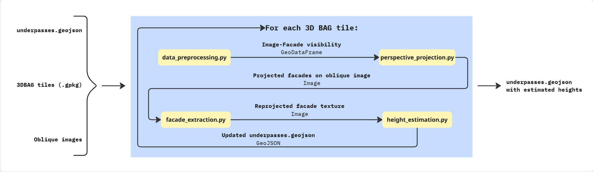
<p align="center">
  <strong>Figure 1:</strong> General pipeline
</p>

<p>
The general pipeline is depicted in <strong>Figure 1</strong>. The code takes as inputs the underpasses polygons in GeoJSON format, a data set of oblique images with their corresponding camera parameters and image footprints polygons (<i>camera_parameters.txt, image_footprints.geojson</i>) and a set of 3D BAG tiles in GeoPackage format. 

The code iterates over each 3D BAG tile, and updates the estimated height of each observed underpass. Once it has iterated over all tiles, writes a GeoJSON file with final height estimations for each underpass.

A more detailed description of each step is given in the upcoming sections.
</p>

### 2.1. Data preprocessing
<p>
The script <strong>data_preprocessing.py</strong> contains the functions for loading and processing input data. It fulfills the following tasks:

1. Loads the camera parameters, the image footprints, the underpass polygons into <i>GeoDataFrames</i>.

2. In each iteration, loads the corresponding lod-0 (building footprints) and lod-22 (3D buildings) geometries in two different <i>GeoDataFrames</i>.

3. Finds the underpass polygons which match the building footprints of the 3D BAG tile, and computes <strong>critical segments</strong>. The critical segments are the intersection between the underpass polygon boundary (buffered) and the building footprint boundary. This segments match the openings of the underpass. <strong>Figure 2</strong> shows four examples of computed critical segments and their corresponding facades in real life.

<table align="center">
<tr>
<td align="center">
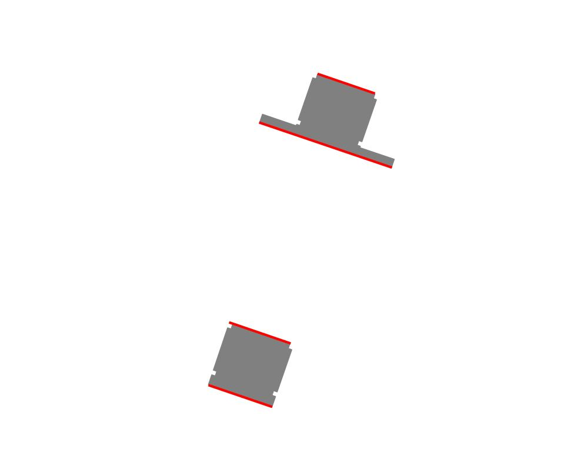<br>
</td>

<td align="center">
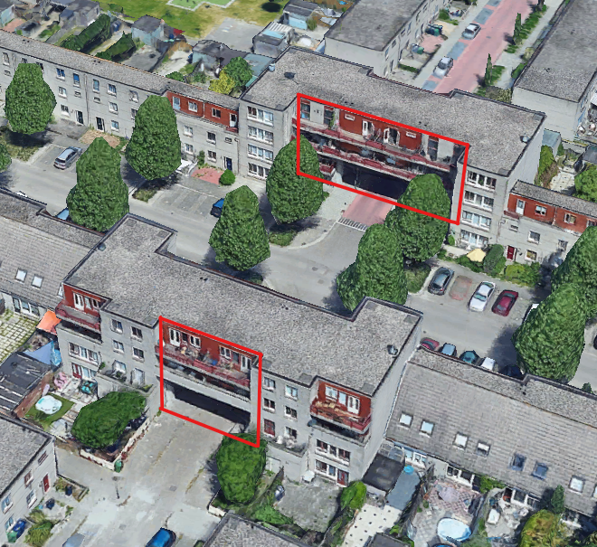<br>
</td>
</tr>
</table>
<p align="center">
  <strong>Figure 2:</strong> Critical segments and their corresponding facades with underpass openings.
</p>

4. Computes the critical walls, which are 3D equivalents to the critical segments. This is done by intersecting the critical segments (buffered) with the 3D building geometries, which returns a set of 3D polygons (walls). Out of this set, we are interested in <strong>min_z</strong> and <strong>max_z</strong>. We will use these values combined with the critical segment coordinates to construct the critical wall geometry. The height of the critical wall is computed as <strong>max_z</strong> - <strong>min_z</strong> and stored as an attribute. <strong>Figure 3</strong> the corresponding critical walls of the critical segments shown in <strong>Figure 2</strong>.


<p align="center">
  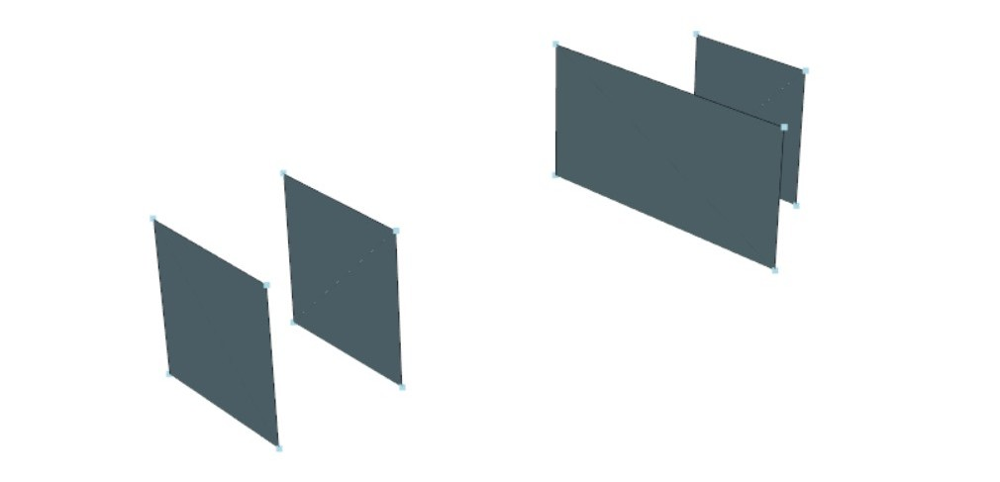
</p>
<p align="center">
  <strong>Figure 3:</strong> Computed critical walls in 3D view.
</p>

5. Constructs an <strong>image-wall</strong> visibility table. This is the most crucial step as it relates each image to a set of visible walls, which is later used in perspective projection. 
   <strong>Table 1</strong> shows an example of the output of such a table.

   <p align="center">
     <strong>Table 1:</strong> Image-wall visibility table.
   </p>


    <div align="center">

   | image_id              | visible_walls                         | camera_x       | camera_y       | camera_z   |
   |-----------------------|---------------------------------------|---------------:|---------------:|-----------:|
   | 402_0029_00131903.tif | [421, 422]                            | 142547.567520 | 488023.933861 | 445.913029 |
   | 402_0029_00131904.tif | [419, 420, 421, 422]                  | 142450.086788 | 488023.509496 | 444.967591 |
   | 402_0029_00131907.tif | []                                    | 142250.161996 | 488022.982741 | 444.541843 |
   | 402_0030_00131343.tif | [464, 298, 297]                       | 143708.653197 | 487789.798263 | 430.346762 |
   | 402_0030_00131344.tif | [465, 464, 461, 462, 298, 297, ...]   | 143807.812084 | 487789.429113 | 429.582020 |

    </div>

    The table is computed by first intersecting the image footprint polygons with the critical wall geometries. This creates a list of intersected wall_ids for each image. However, not all walls in this list are visible/valid. Therefore, we must filter according to the following criteria (<strong>Figure 4</strong>):
    <p> a) The normal of the wall is pointing towards the camera plane.</p>
    <p> b) The angle between the normal of the wall and the normal of the camera plane (θ) is less than a limit angle.</p>

  <table align="center">
    <tr>
    <td align="center">
    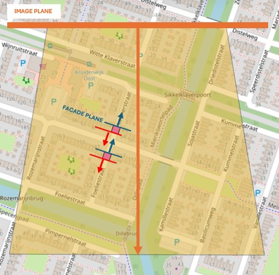<br>
    </td>
    <td align="center">
    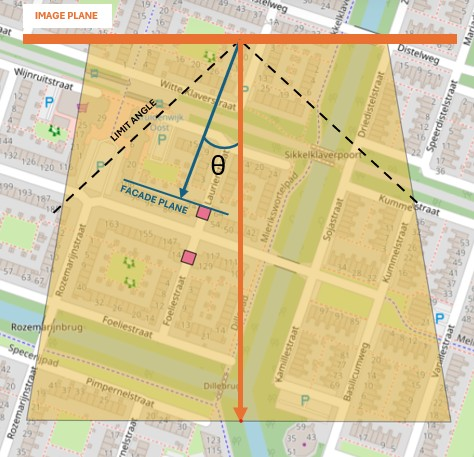<br>
    </td>
    </tr>
    </table>

   <p align="center">
     <strong>Figure 4:</strong> Filtering criteria to determine wall visibility
   </p>

  > [!SUGGESTION]
  > In future implementations investigate facade occlusion as filtering criteria

</p>

### 2.2. Perspective projection
The module <strong>perspective_projection.py</strong> contains all functions to project critical wall geometries (encoded in EPSG:7415) onto the image plane. The code iterates through every row in the <strong>image-wall</strong> visibility table, performs the following tasks:

1. Extracts all visible walls per image

2. Computes the camera matrix $K$ for the current image. We can easily define it using the parameters in <strong>camera_parameters.txt</strong> as follows.

$$
K = 
\begin{bmatrix}
f_x & 0 & c_x \\
0 & f_y & c_y \\
0 & 0 & 1
\end{bmatrix}
$$

3. Calculates the rotation matrix $R = R_\kappa \times \times R_\phi \times R_\omega $. We can find the angles $\kappa$, $\phi$ and $\omega$ in <strong>camera_parameters.txt</strong>, and then compute:


<tr>
<td align="center">

$$
R_\omega =
\begin{bmatrix}
1 & 0 & 0 \\
0 & \cos\omega & -\sin\omega \\
0 & \sin\omega & \cos\omega
\end{bmatrix}
$$

</td>
<td align="center"> 

$$
R_\phi =
\begin{bmatrix}
\cos\phi & 0 & \sin\phi \\
0 & 1 & 0 \\
-\sin\phi & 0 & \cos\phi
\end{bmatrix}
$$

</td>
<td align="center">

$$
R_\kappa =
\begin{bmatrix}
\cos\kappa & -\sin\kappa & 0 \\
\sin\kappa & \cos\kappa & 0 \\
0 & 0 & 1
\end{bmatrix}
$$

</td>
</tr>
</table>

  > [!CAUTION]
  > The multiplication order of rotation matrices depends on the convention chosen for the rotation angles. The given order <code>R = Rκ Rφ Rω</code> is standard for photogrammetry datasets, however, this might be different in your dataset (e.g. <code>R = Rω Rφ Rκ</code>).


  > [!CAUTION]
  > <code>R</code> might need to be transposed <code>R = R.T</code>. This applies when the rotation matrices are defined as rotations from the camera axes to the world axes. 


4. Computes the translation vector $t$. This is straightforward when knowing the camera position $X, Y, Z$, which are defined in <strong>camera_parameters.txt</strong>

$$
t = 
- R \times \begin{bmatrix}
X \\
Y \\
Z
\end{bmatrix}
$$


5. Computes the projection matrix $M$ for the current image.

$$
M = K \space [R \mid t]
$$


6. For each visible wall, extracts the wall geometry and projects it onto the image plane using the projection matrix $M$.

   $$
   \begin{bmatrix} u_h \\ v_h \\ w_h \end{bmatrix} 
   = M \, X_w 
   $$

   The 2D pixel coordinates are obtained by normalizing the homogeneous coordinates.

   $$
   u = \frac{u_h}{w_h}, \quad v = \frac{v_h}{w_h}
   $$

<strong>Figure 5</strong> shows an example of critical walls projected onto the oblique image plane. These  2D polygons will be used in the facade texture extraction.

<p align="center">
  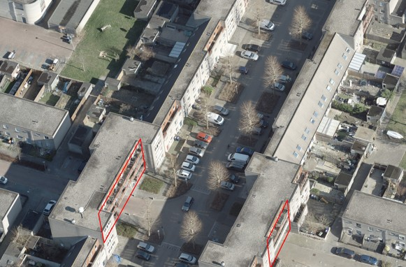
</p>
<p align="center">
  <strong>Figure 5:</strong> Perspective projection of critical walls onto an oblique image
</p>

> [!CAUTION]
> The application of this method relies enormously on the quaity of the oblique image data set. Small errors or inconsistencies in the camera parameters will lead to wrong projections, which will ultimately affect the height estimation. Moreover, multi-cameras data sets might need particular adjustments for each camera (depending on their orientation). In summary, data accuracy is a must, and orientation consistency in all cameras is highly appreciated to increase the generalization of the method.


</p>

### 2.3. Facade texture extraction

The module <strong>facade_extraction.py</strong> includes the functions to extract, reproject and visualize the facade txtures corresponding to the critical walls. This process is done by iterating over the 2D polygons resulting from the critical wall projection onto the image plane. For each polygon:

1. Reorder the polygon coordinates to make sure that the reprojection is done cosnistently.

2. Compute the <strong>width</strong> and the <strong>height</strong> of the output reprojected facade.

3. The output image rectangle will be defined as:

  ```code
output_rectangle = np.array([
                [0, 0],
                [0, height-1],
                [width-1, height-1],
                [width-1, 0]
            ], dtype="float32")
  ```

4.  Apply the reprojection by establishing point correspondances between the 2D polygon and the output rectangle.

Assuming that the extracted facade image height corresponds to the height of the facade in the real world, we will be able to determine the height of the underpasss ceiling by establishing a proportion (pixel - meters). However, we must consider that vertical distances are distorted to a lesser or bigger extent. The ideal situation is when the camera plane is parallel to the facade. <strong>Figure 6 </strong> shows an example of an extracted facade texture.

<p align="center">
  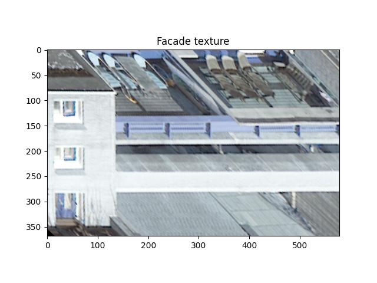
</p>

<p align="center">
  <strong>Figure 6:</strong> Example of an extracted facade texture
</p>


<div style="border-left:5px solid #4a90e2; padding:10px;">
    <strong>Suggestion:</strong> Introduce a vertical correction factor when estimating the height.
</div>

### 2.4. Height estimation methods
The module height_estimation.py contains all functions for detecting underpasses by applying different methods, visualizing, updating the GeoJSON file and writing the output data. The height estimation methods are applied to the extracted facade textures.

#### Connected components method
This naive method consists of applying image segmentation through detecting connected components in the facade image. The goal is to detect which component corresponds to the underpass opening by applying some filtering criteria.

1. Apply a Canny filter on the image and close edges to achieve more defined surfaces.

2. Detect connected component features in the image (delimited surfaces).

3. Apply filtering criteria to detect the underpass opening. The selected component must:

   <p> a) Be higher than a threshold (= 2 m) </p>
   <p> b) Be close to the ground (< 100 px away from the bottom of the image) </p>
   <p> c) Be separated from the top (> 50 px away from the top of the image) </p>
   <p> d) Have a parallelogram shape. This is measured by computing the solidity of the component, which is the area of its bounding box which is actually covered by the component. It is defined as:

   $$ solidity = \frac{component \space area}{component \space height \times component \space width} $$

   </p>
   <p> e) Be centered in the image, since the image of the facade is constructed based on the underpass 2D geometry.</p>

4. Takes the top pixel y-coordinate (<strong>pixel row</strong>) of the selected component, assuming that this corresponds to the underpass ceiling.

5. Estimates the underpass height with the following formula:

  $$ underpass \space height = facade \space height \times \frac{1 - pixel \space row \space}{image \space height} $$

<strong>Figure 7</strong> shows the applied method and the resulting estimated height.

  <table align="center">
    <tr>
    <td align="center">
    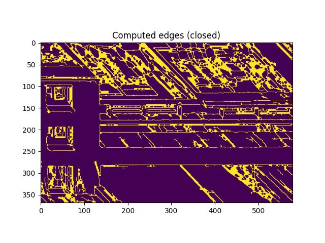<br>
    </td>
    <td align="center">
    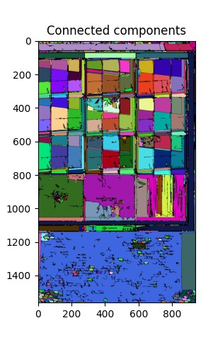<br>
    </td>
    <td align="center">
    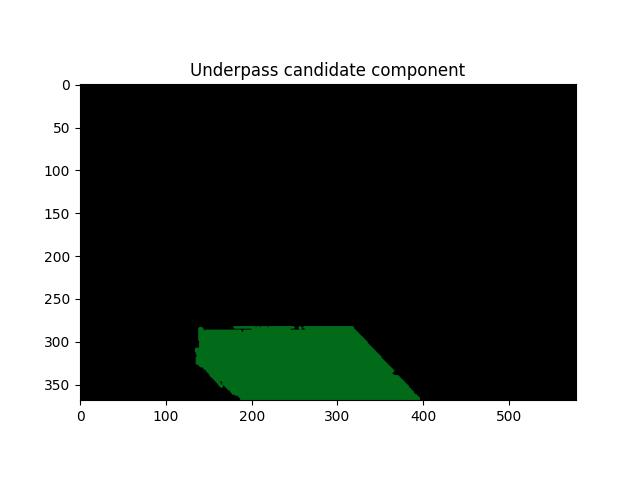<br>
    </td>
    <td align="center">
    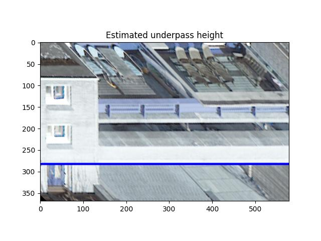<br>
    </td>
    </tr>
    </table>
<p align="center">
  <strong>Figure 7:</strong> application of the connected components method. 
</p>


#### Depth map model method
This method uses a deep learning model that classifies the pixels of the image by depth. Then, it assumes that the underpass corresponds to the deepest cluster of pixels. The model was applied from the commit `e5a2732d3ea2cddc081d7bfd708fc0bf09f812f1` (January 22nd, 2025).

1. Apply Depth-Anything-V2 model on the image.

2. Apply k-means clustering to group the regions by depth (by default 3 clusters)

3. Take the top pixel y-coordinate (<strong>pixel row</strong>) of the deepest cluster, assuming that this corresponds to the underpass ceiling.

4. Apply connected components segmentation to the deepest region and select the component that is closer to the ground. This helps getting rid of sky surfaces.

5. Take the top pixel y-coordinate (<strong>pixel row</strong>) of the selected component, assuming that this corresponds to the underpass ceiling.

6. Estimate the underpass height with the following formula:

  $$ underpass \space height = facade \space height \times \frac{1 - pixel \space row \space}{image \space height} $$

<strong>Figure 8</strong> shows the applied method and the resulting estimated height.

  <table align="center">
    <tr>
    <td align="center">
    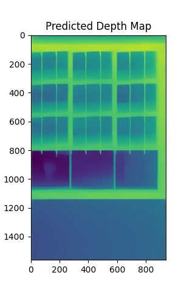<br>
    </td>
    <td align="center">
    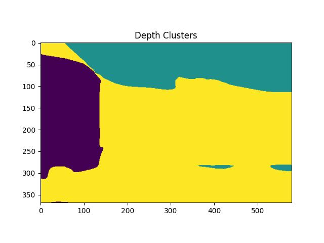<br>
    </td>
    <td align="center">
    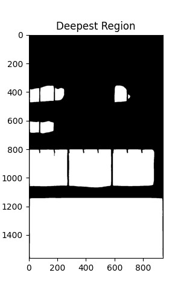<br>
    </td>
    <td align="center">
    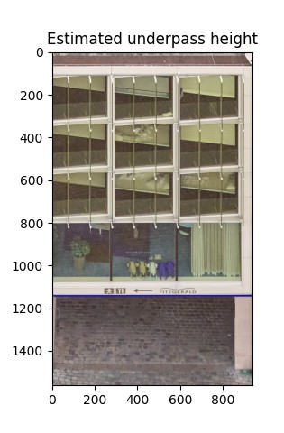<br>
    </td>
    </tr>
    </table>
<p align="center">
  <strong>Figure 8:</strong> application of the depth map method. 
</p>

#### U-Net model method
This method consists of applying a convolutional neural network that is trained to detect the underpass opening. The model was trained using images from facades extracted from oblique images. The limitations of the training data availability and hardware capabilities resulted in a still inaccurate model. However, it can be potentially improved in future research. Further details on how to train the model and about the input data are given in Apendix A.

1. Apply the U-Net model on the image, which returns a binary mask with the predicted underpass region.

2. Apply connected components segmentation to the underpass mask and select the component that is closer to the ground. This helps getting rid of outliers.

3. Take the top pixel y-coordinate (<strong>pixel row</strong>) of the selected component, assuming that this corresponds to the underpass ceiling.

4. Estimate the underpass height with the following formula:

  $$ underpass \space height = facade \space height \times \frac{1 - pixel \space row \space}{image \space height} $$

<strong>Figure 9</strong> shows the applied method and the resulting estimated height.

  <table align="center">
    <tr>
    <td align="center">
    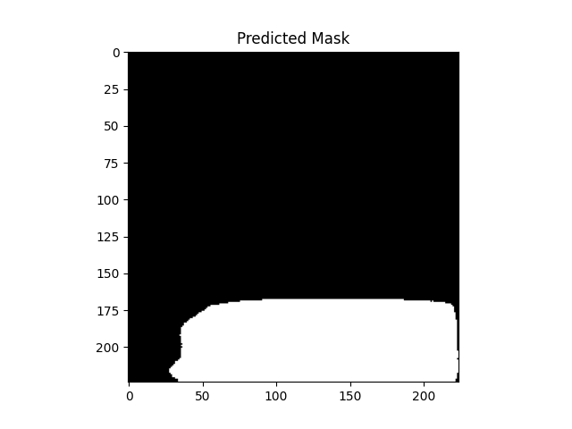<br>
    </td>
    <td align="center">
    <br>
    </td>
    <td align="center">
    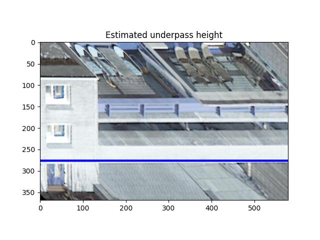<br>
    </td>
    </tr>
    </table>

<p align="center">
  <strong>Figure 9:</strong> application of the U-Net model method. 
</p>

### 2.5. Output data
The estimated heights are stored in the underpass GeoDataFrame. Once the code has iterated over all tiles, it writes the underpass polygons with the estimated heights to a GeoJSON file.


## 3. Assessment of results


## 4. Running the code

There is an example data set that can be used to run the code. The link is provided in this repository.

The following structure is necessary to run the code:

```text
3DBAG_UNDERPASS_HEIGHTS/
├── data/
│   ├── 3dbag_tiles/
│   ├── oblique_images/
│   └── underpass_polygons/
├── src/
│   ├── Depth-Anything-V2/
│   ├── u-net_model/
│   ├── data_preprocessing.py
│   ├── facade_extraction.py
│   ├── height_estimation.py
│   └── perspective_projection.py
├── output/
└── requirements.txt

```

STEP 1. Install requirements.txt in your virtual environment
```python
pip install -r requirements.txt
```
STEP 2. Select the height estimation method
```python
height_estimation_method = "depth_method" # or "cc_method", "unet_method"
```
STEP 3. Adjust input file names if necessary
```python
camera_parameters_path = os.path.join(images_directory, 'camera_parameters.txt')
image_footprints_path = os.path.join(images_directory, 'image_footprints.geojson')
underpasses_path = os.path.join(underpasses_directory, 'underpasses.geojson')
```
STEP 4. Run the code