# Underpass Detection

⚠️ **Important:** Results are stored in the `underpasses` schema in baseregisters (Gilfoyle)

## Part 1: Detection and Simplification

Underpasses in Dutch building data can be detected by subtracting BAG (building registration) from BGT (topographic registration) geometries. However, since these two datasets are not perfectly aligned, the resulting difference geometries contain numerous sliver polygons. This necessitates implementing a multi-step simplification process to remove these artifacts while preserving genuine underpass areas.

Several methods were evaluated including erosion/dilation, geometric snapping, and grid-based snapping. The combination of steps described below proved most effective so far.

### Step 1: Preprocessing and Geometry Join

BGT data often contains multiple polygons for the same pand id. In this preprocessing step, we merge these BGT polygons per building and create a join table with BAG data.

### Step 2: Initial BAG-BGT Difference Calculation, filtered through Double Buffering per Geometry

The initial underpass detection uses `ST_Difference` to subtract BGT geometries from BAG geometries. Only polygon geometries from the result are retained using `ST_CollectionExtract(raw_diff, 3)`, which filters out any resulting points or lines: 

This initial BAG-BGT operation yields **1,972,190** potential underpass polygons from approximately 2 million buildings. However, this result contains numerous sliver polygons caused by minor geometric differences between BGT and BAG datasets. These artifacts do not represent actual underpasses and require cleanup through the following processing steps.

<figure>
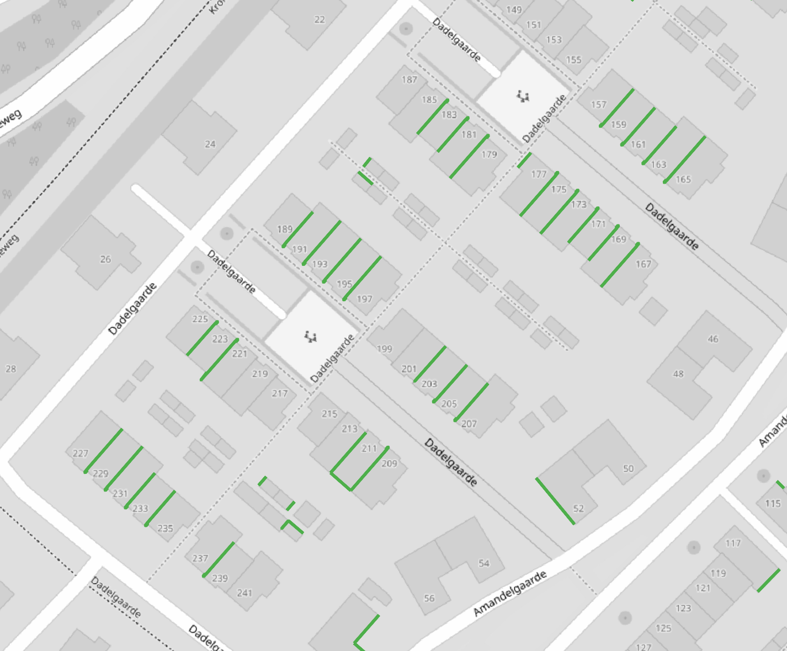
<figcaption>Example of sliver polygons resulting from the BAG-BGT difference</figcaption>
</figure>

This is how the results are also filtered with an erosion/dilation operation (double buffering) with a threshold of **0.2 meters**. This step removes thin sliver polygons while preserving substantial underpass areas. This operation reduces the underpass count from ~2 million to **304,897** geometries.

⚠️ **Note:** This filtering primarily addresses cases where BGT and BAG polygons are nearly identical, with differences consisting mainly of sliver polygons. When substantial geometric differences exist between the datasets (e.g., an underpass or other architectural detail), some sliver polygons may also remain within the overall geometry and require further processing in subsequent steps. 

<table>
  <tr>
    <td>
      <figure>
        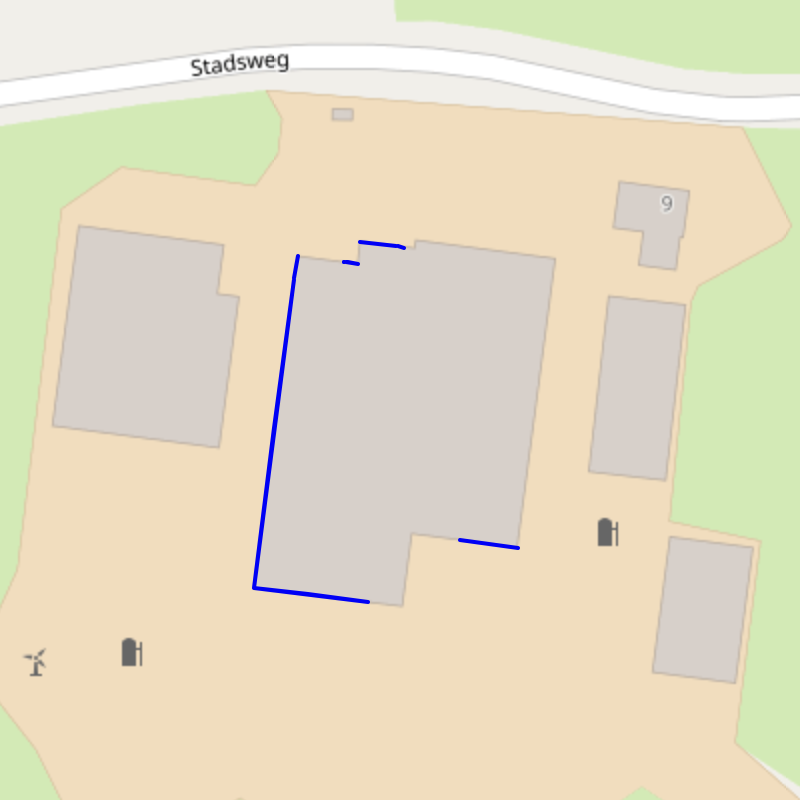
        <figcaption>These polygons are removed in this step</figcaption>
      </figure>
    </td>
    <td>
      <figure>
        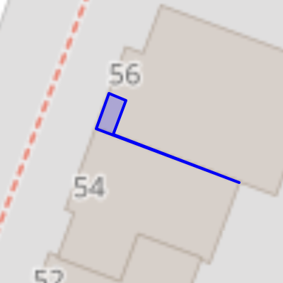
        <figcaption>These polygons remain</figcaption>
      </figure>
    </td>
  </tr>
</table>

### Step 3: Double Snapping

For the filtered dataset, we perform a more sophisticated difference calculation using geometric snapping to better align BAG and BGT geometries. This step uses a **0.03m** snapping tolerance to handle small misalignments between datasets.

### Step 4: Final Filtering through Double Buffering per Geometry

As a final step, we break down multipolygons into individual components and apply another erosion/dilation operation at the polygon level. This removes any remaining thin artifacts within multipolygon geometries and then reassembles the surviving polygons back into multipolygons per building:

### Step 5: Indexes and Primary Key

Indexes and primary key constraints are applied to ensure better performance in later steps.

### Results:

This multi-step approach effectively removes sliver polygons while preserving genuine underpass geometries, resulting in a clean dataset suitable for further analysis. Here are some examples from the results. With blue are the parts that got removed and with red the parts that got preserved:

<table>
  <tr>
    <td>
      <figure>
        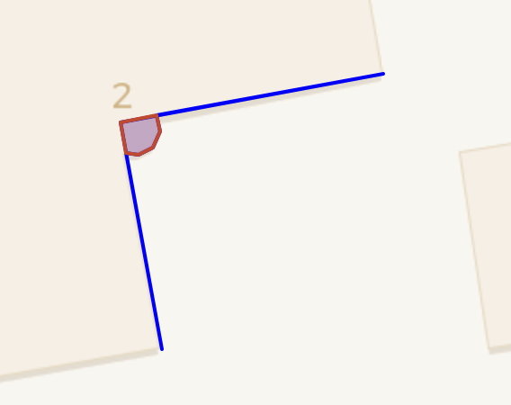
        <figcaption>NL.IMBAG.Pand.0003100000118006</figcaption>
      </figure>
    </td>
    <td>
      <figure>
        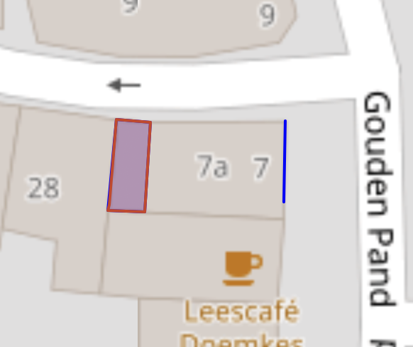
        <figcaption>NL.IMBAG.Pand.0003100000118401</figcaption>
      </figure>
    </td>
    <td>
      <figure>
        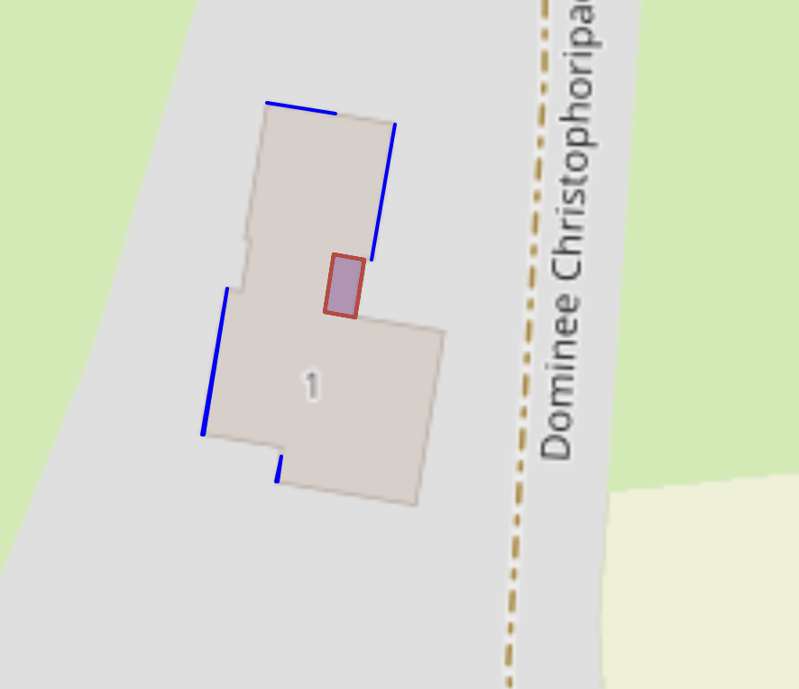
        <figcaption>NL.IMBAG.Pand.0003100000118462</figcaption>
      </figure>
    </td>
  </tr>
</table>

Where it doesn't work perfectly:

<table>
  <tr>
    <td>
      <figure>
        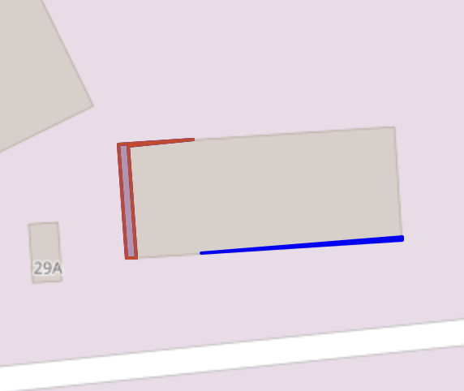
        <figcaption>NL.IMBAG.Pand.0010100000008514</figcaption>
      </figure>
    </td>
    <td>
      <figure>
        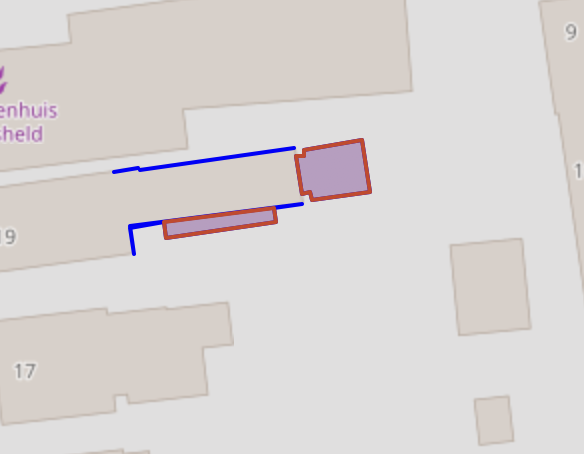
        <figcaption>NL.IMBAG.Pand.0005100000002807</figcaption>
      </figure>
    </td>
    <td>
      <figure>
        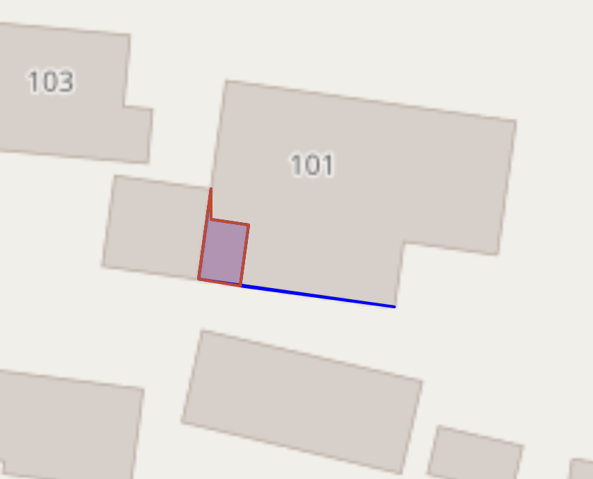
        <figcaption>NL.IMBAG.Pand.0003100000117823</figcaption>
      </figure>
    </td>
  </tr>
</table>

To avoid those cases we could increase the threshold for the double snapping, however this will affect the polygons of certain underpasses. For example, for building **NL.IMBAG.Pand.0599100000635797**, the underpass polygon is preserved better with 3cm instead of 5cm threshold:

<table>
  <tr>
    <td>
      <figure>
        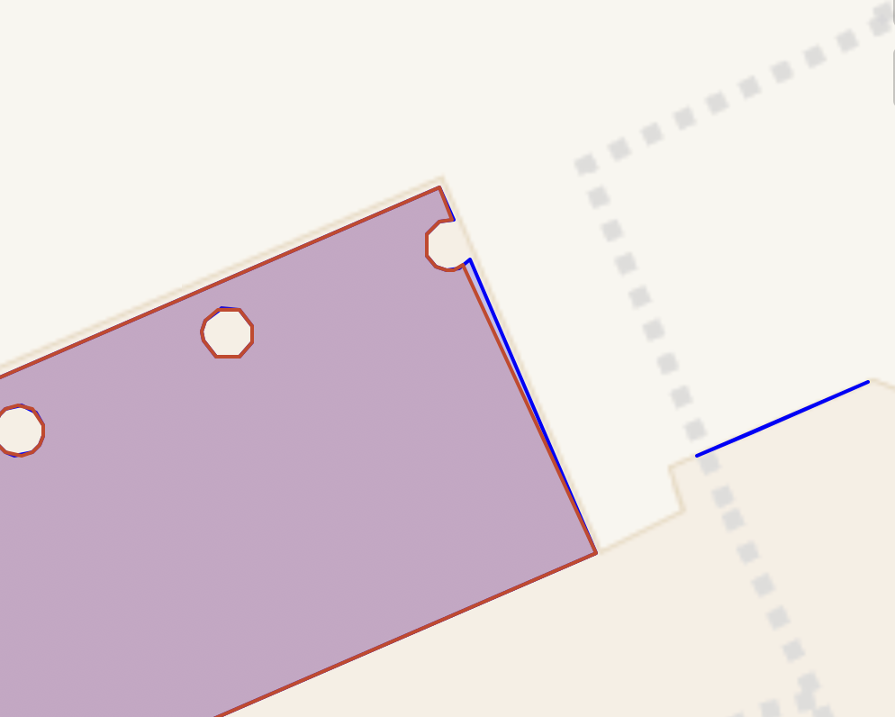
        <figcaption>Threshold 3cm</figcaption>
      </figure>
    </td>
    <td>
      <figure>
        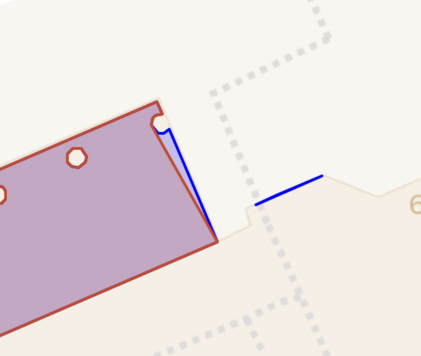
        <figcaption>Threshold 5cm</figcaption>
      </figure>
    </td>
  </tr>
</table>

Finally, when compared with the "outer ceiling surfaces" from 3D rotterdam, the polygon of the underpasses have minimal differences.

  <figure>
    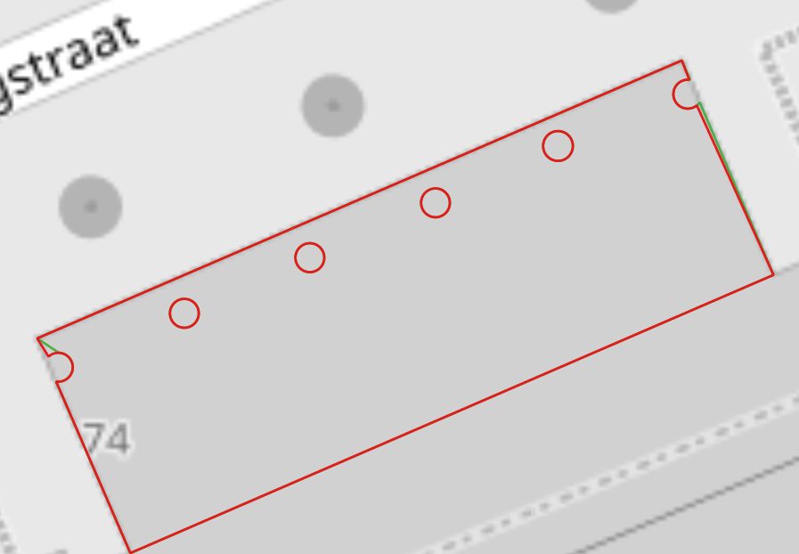
    <figcaption>NL.IMBAG.Pand.0599100000635797: Red our detected underpass, green from 3DRotterdam</figcaption>
  </figure>

## Part 2: Edge Classification and expansion
