# Underpass Height From Street LiDAR

This directory contains a Python workflow for estimating underpass height from cropped LAS/LAZ point clouds and matching polygons stored in GeoPackages.

> The cropped point cloud was generated using roofer:
> ```
> roofer --ceil-point-density 100 --crop-only --crop-output  122200_486000.laz voormaligeStadstimmertuin.gpkg data/roofer-out
> ```
> The GPKG file contains the underpass polygon of interest from the 2D detection pipeline. The pointcloud is one of the files Amsterdam gave to us. To save space, these two files are not included in this repository, but the relvant roofer output is included.

The script loops over a list of BAG cases, reads each LAS/LAZ file and its matching GeoPackage polygon, detects Z-peak candidates from a smoothed histogram, rasterizes each candidate to the XY plane at `0.5 m` resolution, and keeps only candidates whose raw histogram count is at least `5%` of the second-highest candidate raw count.

For each remaining candidate, the script computes:

- the raw occupied raster
- an exclusive raster with lower peaks masked out
- pairwise vertical-wall cells between adjacent peaks
- a union raster of exclusive cells and related wall cells

The final two underpass peaks are chosen as the two peaks with the largest contiguous area in that union raster. Each peak uses a fixed `1.0 m` vertical band centered on the selected histogram bin.

## What The Script Produces

- A histogram of Z values with raw bars, a smoothed curve, one marker and fixed `1.0 m` band per displayed peak, and a double-headed height-difference annotation for the two selected underpass peaks
- One XY raster row showing all displayed peak bands
- One XY raster row showing the union of exclusive cells and pairwise wall cells for each displayed peak
- Optional diagnostic rows for:
  - exclusive cells with lower peaks masked out
  - related wall cells between adjacent peaks
- One PNG per BAG id, named `<bag_id>_peak_grids_overlay.png`
- A CSV summary written to `underpass_heights.csv`
- A Rerun visualization sent to the viewer by default

## Example Cases

The `images/` directory contains point-cloud screenshots and matching script outputs for several BAG ids.

### `NL.IMBAG.Pand.0363100012095711`

Point cloud:

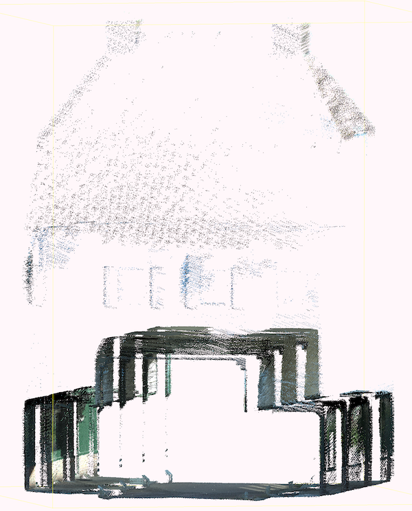

Script output:

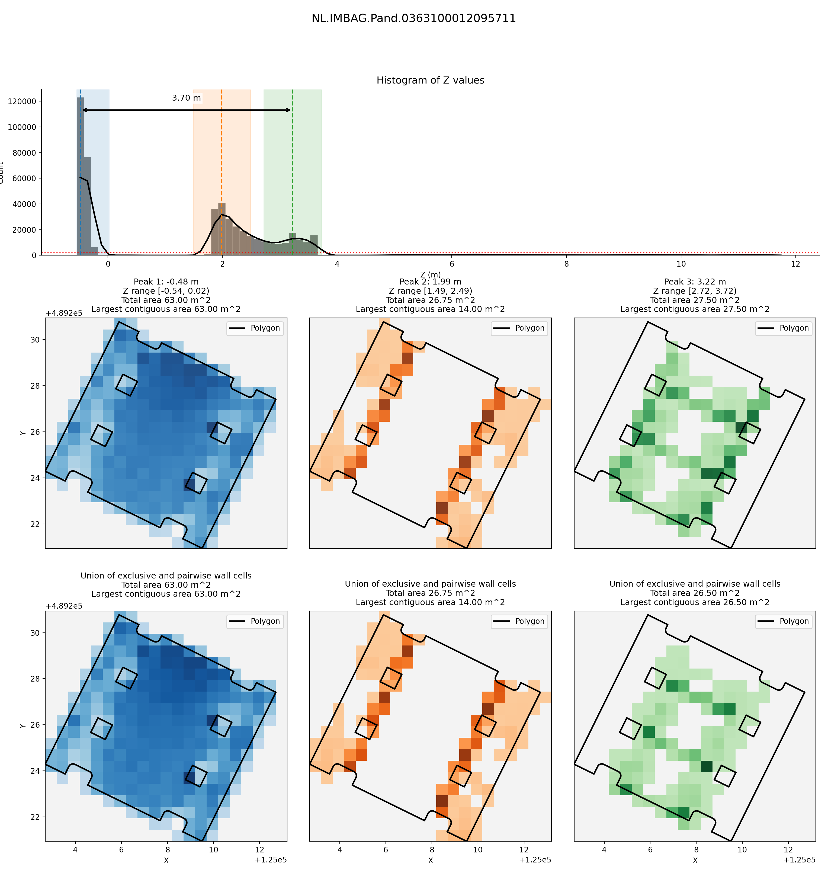

### `NL.IMBAG.Pand.0363100012122448`

Point cloud:

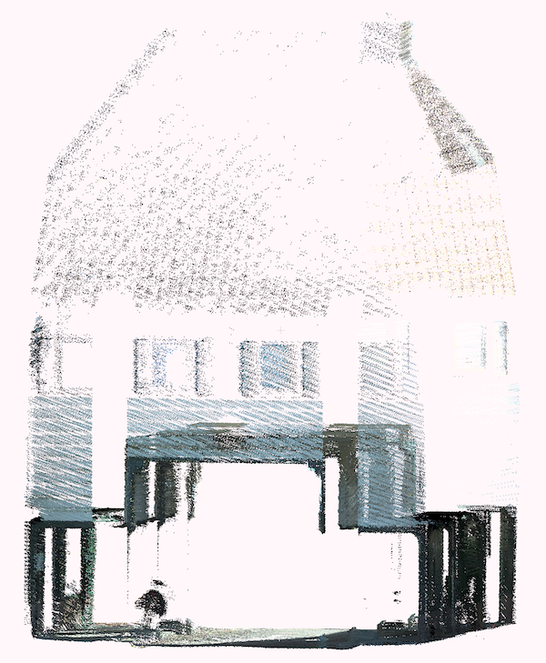

Script output:

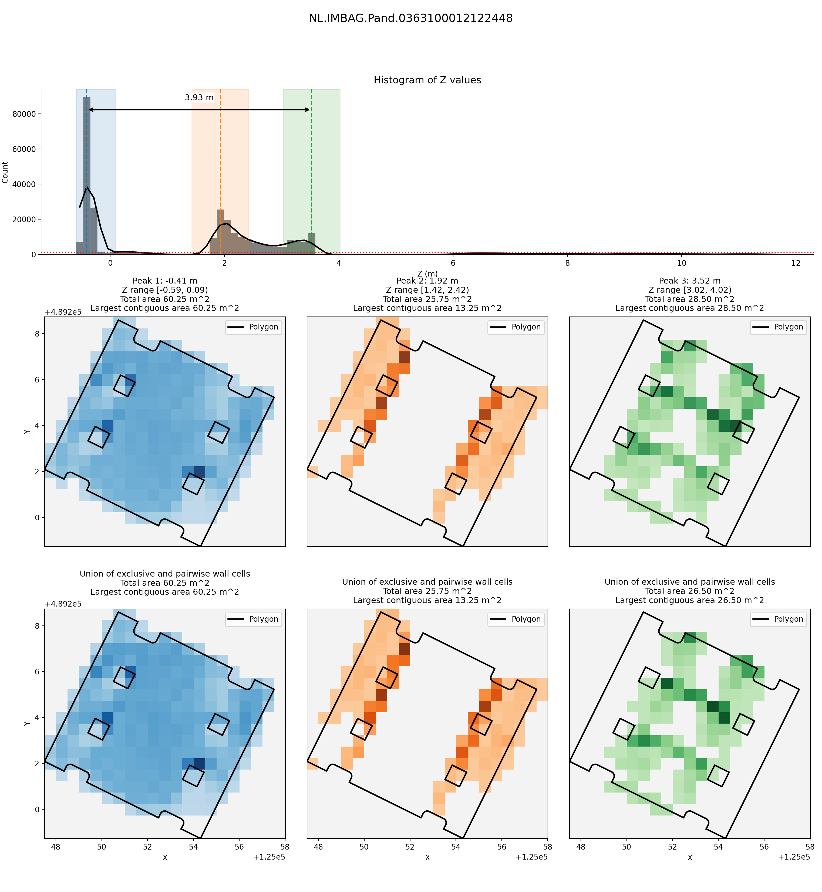

### `NL.IMBAG.Pand.0363100012137139`

Point cloud:

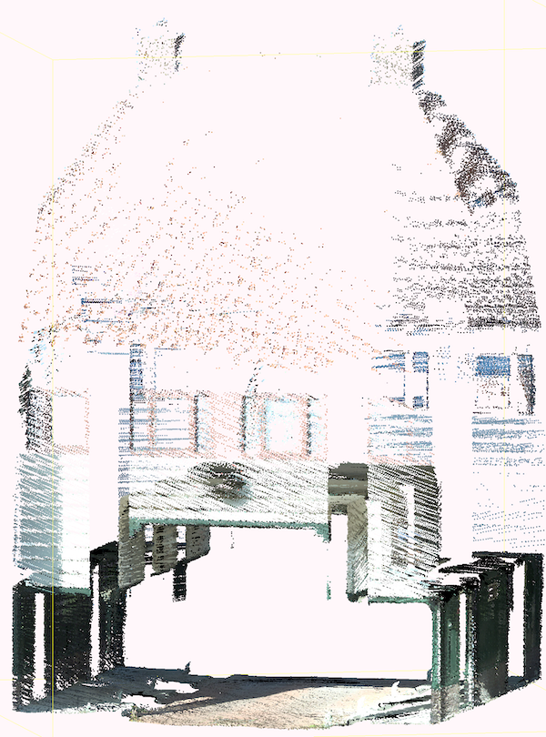

Script output:

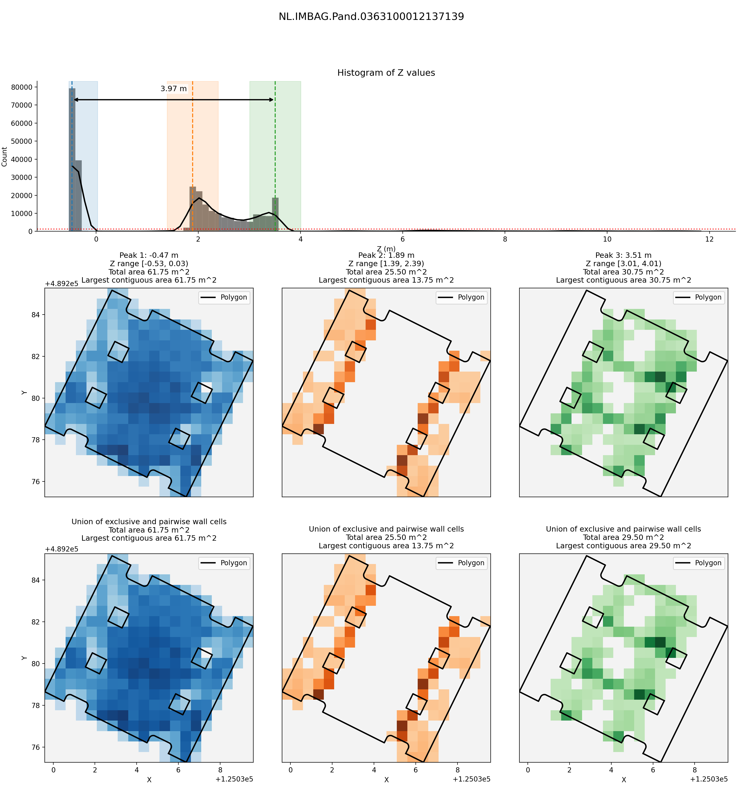

### `NL.IMBAG.Pand.0363100012146576`

Point cloud:

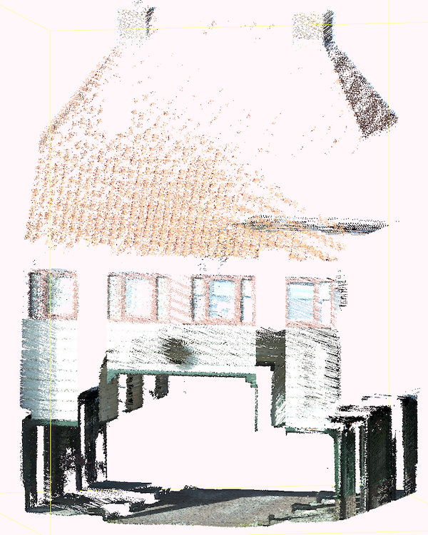

Script output:

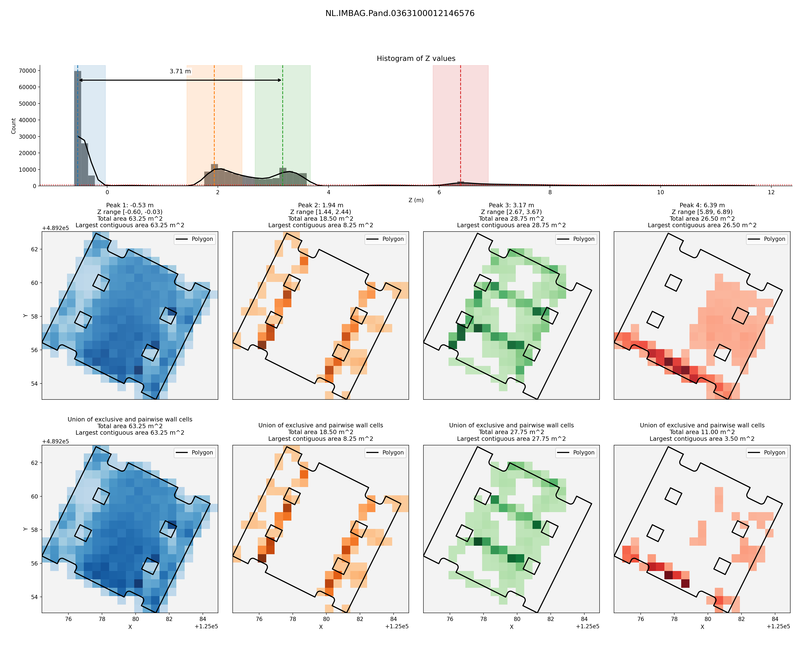

### `NL.IMBAG.Pand.0363100012165755`

Point cloud:

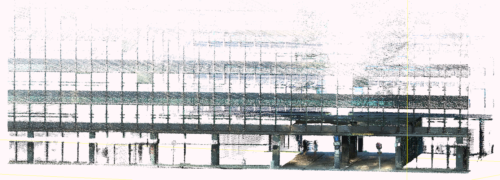

Script output:

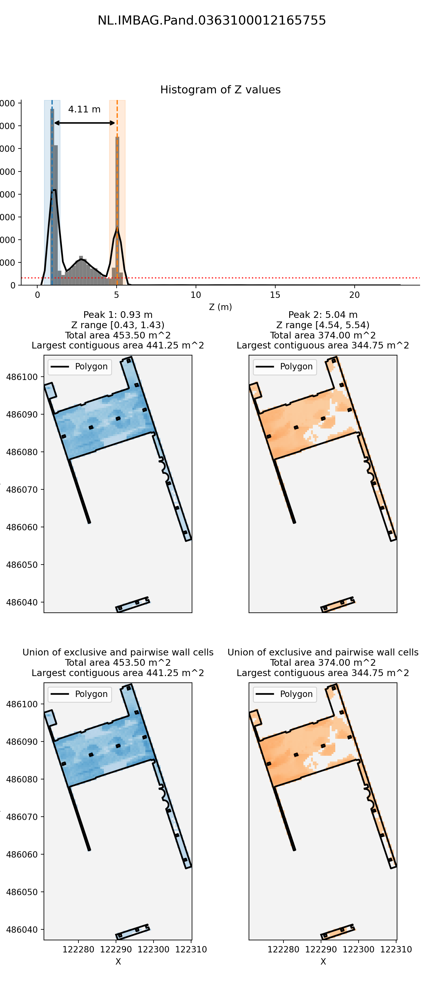

### `NL.IMBAG.Pand.0363100012170850`

Point cloud:

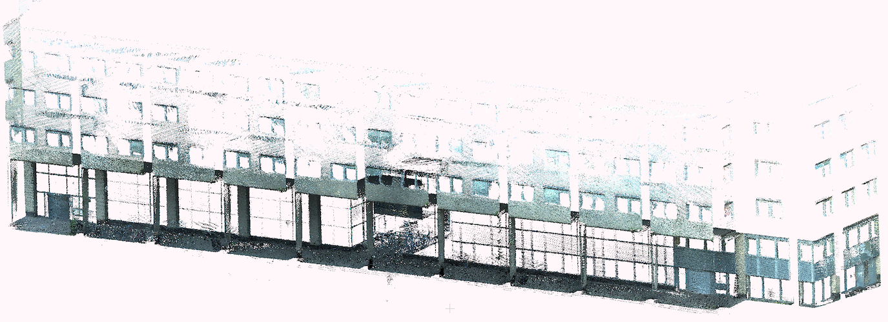

Script output:

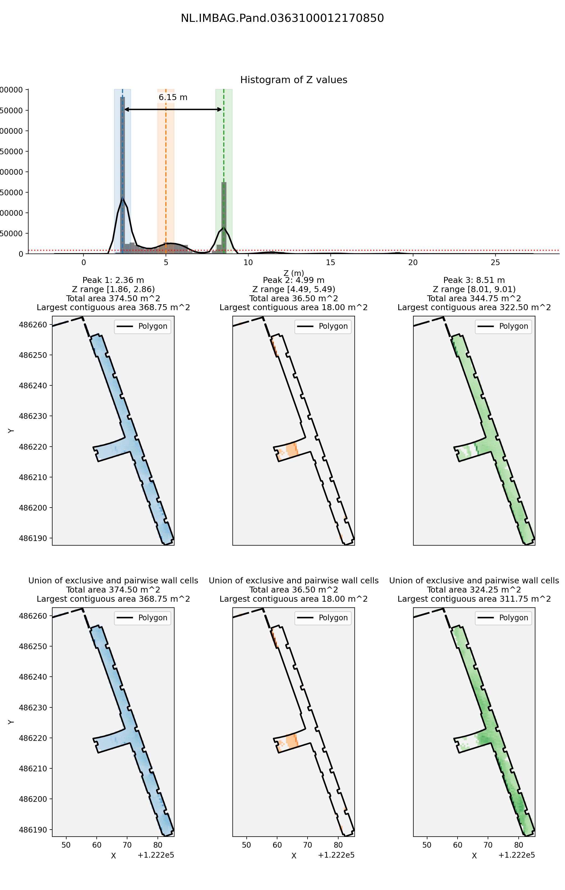

## Run With Nix

From this directory:

```bash
nix develop -c python3 plot_z_histogram.py
```

## Run Without Nix

Use Python 3. Then install the required packages:

```bash
python3 -m pip install laspy matplotlib numpy rerun-sdk shapely
```

Run the script:

```bash
python3 plot_z_histogram.py
```

## Files

- `plot_z_histogram.py`: main analysis and plotting script
- `flake.nix`: Nix development shell with Python dependencies
- `underpass_heights.csv`: CSV summary written by the script
- `images/`: example point-cloud screenshots and BAG-specific script outputs
