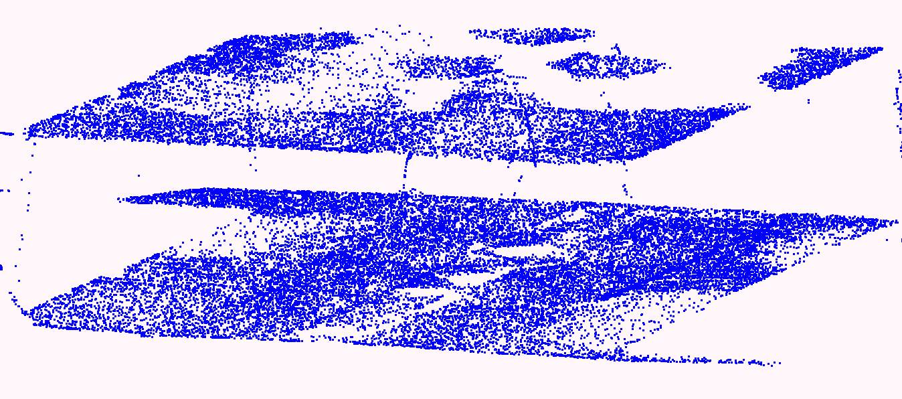
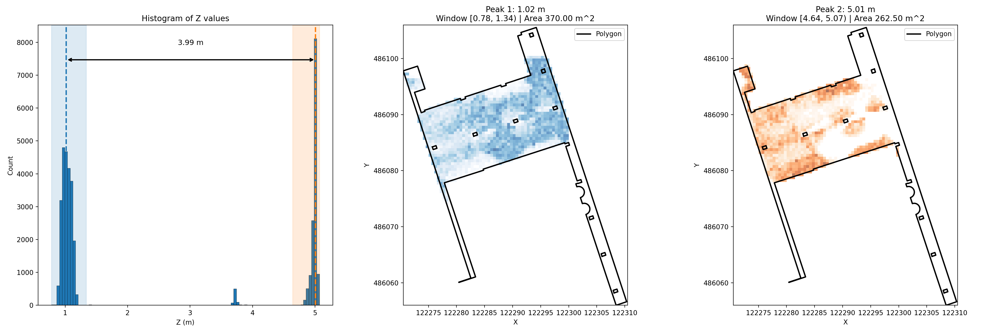

# Underpass Height From Street LiDAR

This directory contains a small Python workflow for estimating an underpass height from a cropped LAS point cloud and a matching polygon stored in a GeoPackage.

> The cropped point cloud was generated using roofer:
> ```
> roofer --ceil-point-density 100 --crop-only --crop-output  122200_486000.laz voormaligeStadstimmertuin.gpkg data/roofer-out
> ```
> The GPKG file contains the underpass polygon of interest from the 2D detection pipeline. The pointcloud is one of the files Amsterdam gave to us. To save space, these two files are not included in this repository, but the relvant roofer output is included.

The script reads [`data/roofer-out/objects/0/crop/0_.las`](/Users/ravi/git/underpass-detection-experiments/height_from_streetlidar/data/roofer-out/objects/0/crop/0_.las), finds the two dominant peaks in the Z histogram, treats them as the lower and upper height clusters, rasterizes the points from each cluster onto the XY plane at `0.5 m` resolution, and overlays those rasters with the polygon from [`data/roofer-out/objects/0/crop/0.gpkg`](/Users/ravi/git/underpass-detection-experiments/height_from_streetlidar/data/roofer-out/objects/0/crop/0.gpkg).

It also writes the derived attributes back into the GeoPackage feature table:

- `underpass_dh`: difference between the two detected peak heights
- `underpass_top_area`: occupied raster area for the upper peak cluster
- `underpass_bottom_area`: occupied raster area for the lower peak cluster

## What The Script Produces

- A histogram of Z values with:
  - the two detected peak lines
  - shaded peak windows
  - a double-headed arrow labeled with the height difference
- One XY raster subplot for the lower peak and one for the upper peak, each overlaid with the polygon outline
- An output image written to [`peak_grids_overlay.png`](/Users/ravi/git/underpass-detection-experiments/height_from_streetlidar/peak_grids_overlay.png)
- Updated attributes in [`data/roofer-out/objects/0/crop/0.gpkg`](/Users/ravi/git/underpass-detection-experiments/height_from_streetlidar/data/roofer-out/objects/0/crop/0.gpkg)

## Current Result

On the current input data, the script reports:

- Lower peak: about `1.02 m`
- Upper peak: about `5.01 m`
- Height difference: `3.99 m`
- Bottom area: `370.0 m^2`
- Top area: `262.5 m^2`

These results are also made available as attributes in the GeoPackage file:

- `underpass_dh = 3.9897`
- `underpass_top_area = 262.5`
- `underpass_bottom_area = 370.0`

## Example Images

Point cloud view:



Script output:



## Run With Nix

From this directory:

```bash
nix develop -c python3 plot_z_histogram.py
```

For a headless run that writes the figure without opening a window:

```bash
nix develop -c env MPLBACKEND=Agg python3 plot_z_histogram.py
```

## Run Without Nix

Use Python 3. Then install the required packages:

```bash
python3 -m pip install laspy matplotlib numpy shapely
```

Run the script:

```bash
python3 plot_z_histogram.py
```

For headless output:

```bash
MPLBACKEND=Agg python3 plot_z_histogram.py
```

## Files

- [`plot_z_histogram.py`](/Users/ravi/git/underpass-detection-experiments/height_from_streetlidar/plot_z_histogram.py): main analysis and plotting script
- [`flake.nix`](/Users/ravi/git/underpass-detection-experiments/height_from_streetlidar/flake.nix): Nix development shell with Python dependencies
- [`images/pointcloud.png`](/Users/ravi/git/underpass-detection-experiments/height_from_streetlidar/images/pointcloud.png): reference point cloud image
- [`images/peak_grids_overlay.png`](/Users/ravi/git/underpass-detection-experiments/height_from_streetlidar/images/peak_grids_overlay.png): example script output image
