# Underpass Height From Street LiDAR

This directory contains a Python workflow for estimating underpass height from cropped LAS/LAZ point clouds and matching polygons stored in GeoPackages.

> The cropped point clouds were generated using the script in `../crop_las_by_polygons`:

The script loops over a list of BAG cases, reads each LAS/LAZ file and its matching GeoPackage polygon, detects Z-peak candidates from a smoothed histogram, and rasterizes each candidate to the XY plane at `0.5 m` resolution. The elevation histogram uses fixed-width bins anchored at global elevation `0`; configure their width with `HISTOGRAM_BIN_WIDTH_METERS`. Diagnostic plots and the compact elevation output include candidates whose raw peak-bin count is at least `1000`, whose raw count is also at least `5%` of the second-highest candidate raw count, and whose total raster mask area is at least both `4 m²` and `5%` of the polygon area. All detected candidates remain available in the detailed debug JSON.

For each detected candidate, the script computes a raw occupied raster. Candidate
peaks that pass both absolute thresholds are emitted in the compact elevation
list, ordered by largest contiguous raw surface area. Ties are broken by total
covered area and then by smoothed histogram count. Exclusive-pixel and
vertical-wall masks are not applied. The detailed debug JSON contains all
detected peaks. Each peak uses a fixed `1.0 m` vertical band centered on its
histogram bin.

Configure the eligibility thresholds with `PEAK_MIN_RAW_COUNT`,
`DISPLAY_PEAK_MIN_RELATIVE_RAW_COUNT`, `PEAK_MIN_MASK_AREA_M2`, and
`PEAK_MIN_MASK_AREA_POLYGON_FRACTION` in `height_estimation.py`.

Each peak in the detailed debug JSON also contains raw-peak shape metrics. By
default these use a `0.5 m` neighbourhood on each side of the refined raw peak
and a centered `0.2 m`-wide point window:

- `peak_window_point_count`: raw points inside the centered point window
- `local_prominence`: raw peak-bin count minus the higher median count of the
  left and right shoulder bins
- `relative_prominence`: local prominence divided by the raw peak-bin count
- `concentration`: window point count divided by the raw point count within
  the full neighbourhood
- `width_m`: interpolated raw-histogram width at half-prominence, or `null`
  when the raw peak has no positive local prominence

Configure these dimensions with `PEAK_METRIC_NEIGHBOURHOOD_METERS` and
`PEAK_METRIC_WINDOW_WIDTH_METERS` in `height_estimation.py`.

## What The Script Produces

- A histogram of Z values with raw bars, a smoothed curve, and one marker and fixed `1.0 m` band per displayed peak
- A metrics table with one column per selected peak, ordered left-to-right by
  elevation to match the histogram; its `Rank` row shows production area rank
- One XY raster row showing the raw mask for each selected peak band
- One PNG per BAG id, named `<bag_id>_peak_grids_overlay.png`
- A CSV summary written to `underpass_heights.csv`, with the production field
  `underpass_candidate_elevations` containing only threshold-passing candidate elevations,
  ordered by descending raw contiguous area, plus detailed
  `underpass_candidate_peaks` JSON for debugging
- A Rerun visualization sent to the viewer by default

## Example Cases

The `images/` directory contains point-cloud screenshots and matching script outputs for several BAG ids.

### `NL.IMBAG.Pand.0363100012095711`

Point cloud:

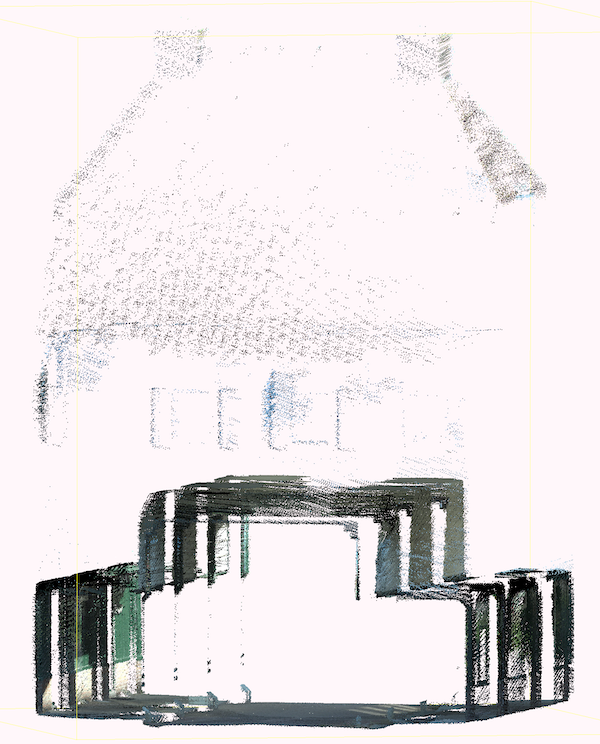

Script output:

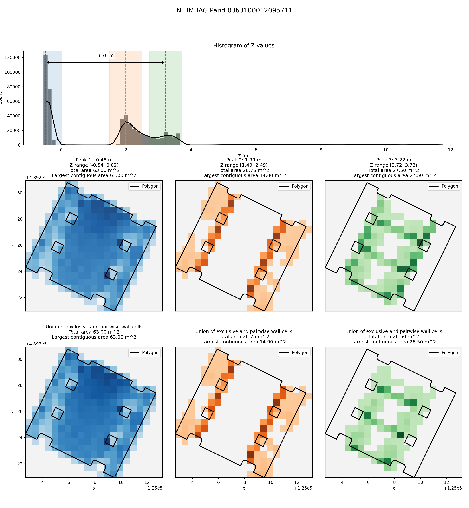

### `NL.IMBAG.Pand.0363100012122448`

Point cloud:

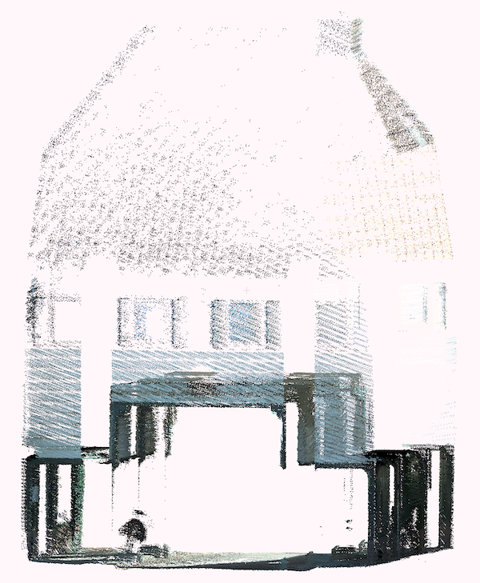

Script output:

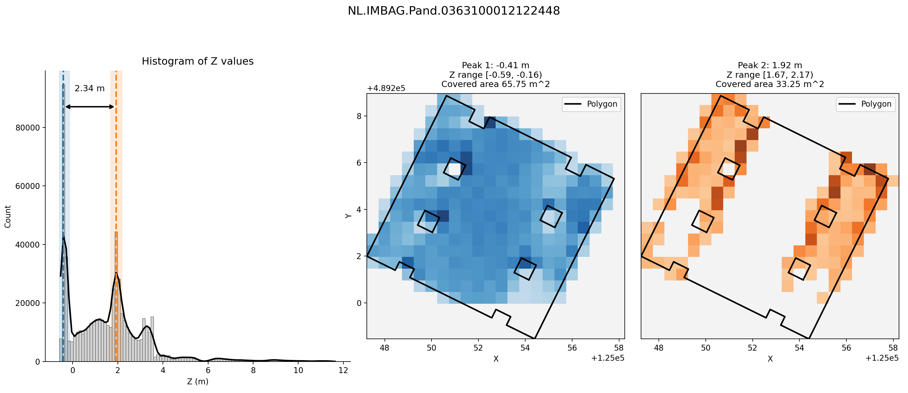

### `NL.IMBAG.Pand.0363100012137139`

Point cloud:

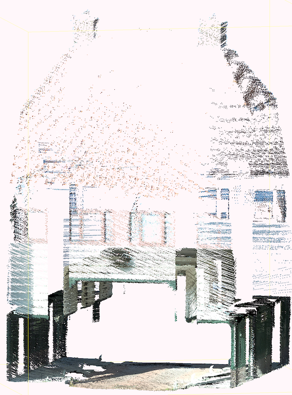

Script output:

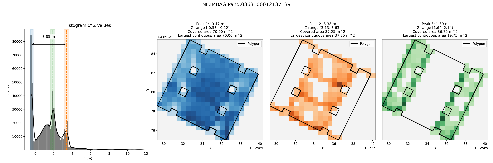

### `NL.IMBAG.Pand.0363100012146576`

Point cloud:

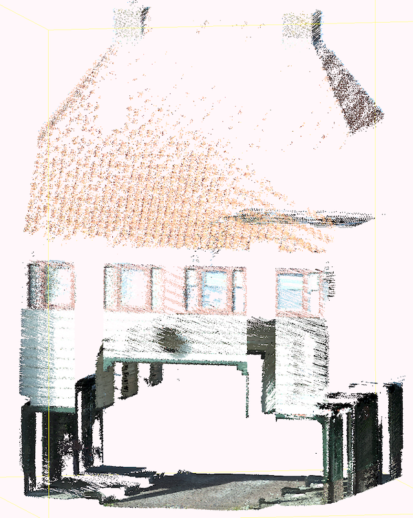

Script output:

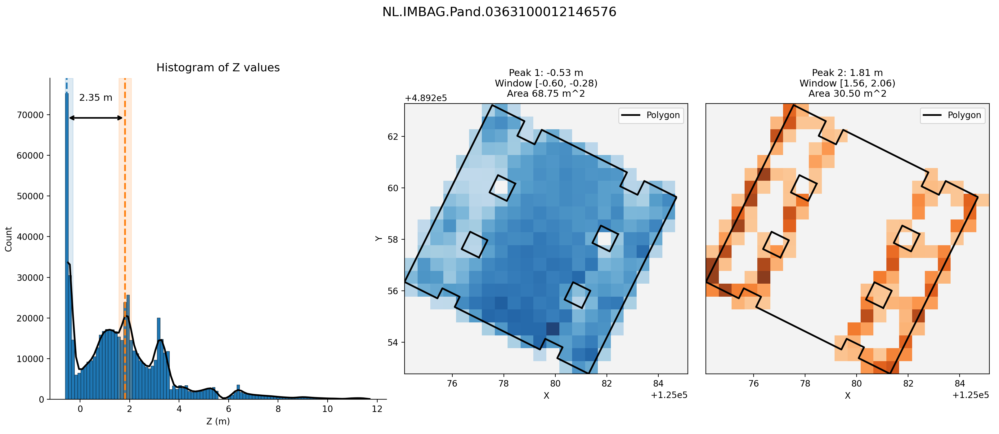

### `NL.IMBAG.Pand.0363100012165755`

Point cloud:

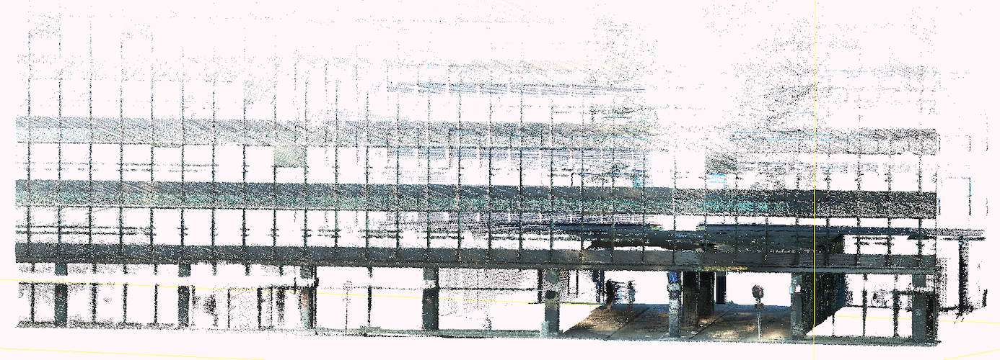

Script output:

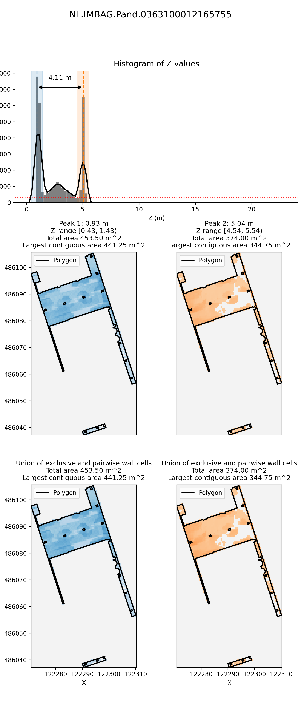

### `NL.IMBAG.Pand.0363100012170850`

Point cloud:

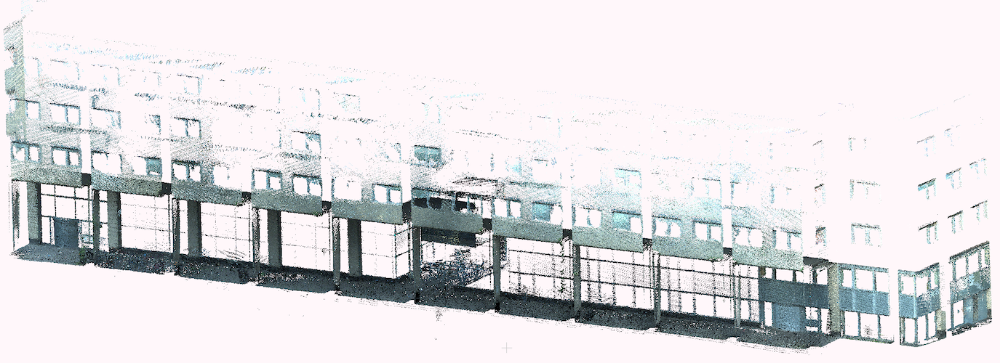

Script output:

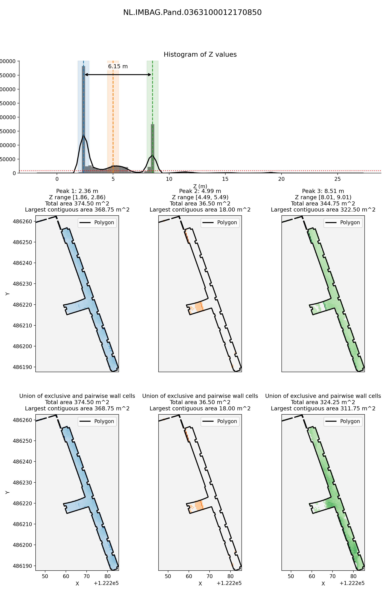

## Run With Nix

From this directory:

```bash
nix develop -c python3 estimate_heights.py
```

Run the diagnostic plot/Rerun workflow:

```bash
nix develop -c python3 plot_z_histogram.py
```

## Run Without Nix

Use Python 3. Then install the required packages:

```bash
python3 -m pip install laspy matplotlib numpy shapely
```

Rerun visualization is optional:

```bash
python3 -m pip install rerun-sdk
```

Run the script:

```bash
python3 estimate_heights.py
```

Run the diagnostic plot/Rerun workflow:

```bash
python3 plot_z_histogram.py
```

## Files

- `height_estimation.py`: plot-free height estimation core
- `estimate_heights.py`: height-only CSV script
- `plot_z_histogram.py`: diagnostic plotting and Rerun script
- `cases.py`: shared input case list
- `flake.nix`: Nix development shell with Python dependencies
- `underpass_heights.csv`: CSV summary written by the script
- `images/`: example point-cloud screenshots and BAG-specific script outputs
